<!-- ═══════════════════════════════════════════════════════════════════════════
     BPUT Result Fetcher, README
     SGPA in seconds. Unofficial student tool. Not affiliated with BPUT.
     Every figure in this document is either a measured constant committed to the
     repository or a live value read from the database, with the date it was read.
     ═══════════════════════════════════════════════════════════════════════════ -->

<p align="center">
  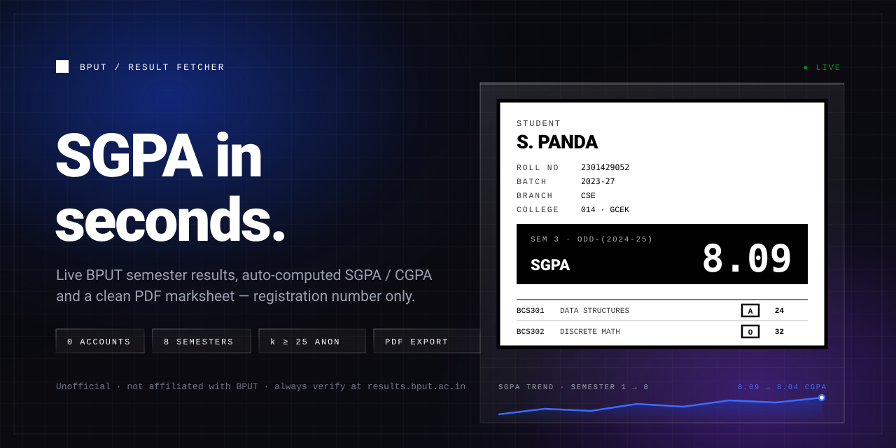
</p>

<h1 align="center">BPUT&nbsp;Result&nbsp;Fetcher</h1>

<p align="center">
  <strong>SGPA in seconds.</strong><br/>
  Live BPUT semester results, auto-computed SGPA&nbsp;/&nbsp;CGPA, a clean PDF marksheet and a
  self-maintaining census of the university's own registration numbering, by registration number only.
</p>

<p align="center">
  <a href="https://result.unifies.codes"></a>
  <a href="https://github.com/flawsom/result/actions/workflows/ci.yml"></a>
  
  
  
  
</p>

<p align="center">
  <a href="https://github.com/flawsom/result/stargazers"></a>
  <a href="https://github.com/flawsom/result/forks"></a>
  <a href="https://github.com/flawsom/result/issues"></a>
  <a href="https://github.com/flawsom/result/pulls"></a>
  <a href="https://github.com/flawsom/result/commits/main"></a>
  <a href="https://github.com/flawsom/result"></a>
  
</p>

<p align="center">
  <a href="https://result.unifies.codes"></a>
  <a href="#-documentation"></a>
  <a href="#-quick-start"></a>
  <a href="https://github.com/flawsom/result"></a>
</p>

<p align="center">
  <a href="https://www.producthunt.com/products/bput-result-fetcher-sgpa-in-seconds?utm_source=badge-featured&utm_medium=badge&utm_campaign=badge-bput-result-fetcher-sgpa-in-seconds" target="_blank" rel="noopener noreferrer">
    
  </a>
</p>

> [!IMPORTANT]
> **Unofficial and independent.** This project is **not affiliated with, endorsed by, or operated by** Biju Patnaik University of Technology (BPUT) or any government body. It reads the university's **public** result endpoints and presents what they return. Your authoritative record always remains [`results.bput.ac.in`](https://results.bput.ac.in).

<table>
  <tr>
    <td align="center" width="20%"><strong>0</strong><br/><sub>accounts needed to look up a result</sub></td>
    <td align="center" width="20%"><strong>8</strong><br/><sub>semesters fetched in parallel</sub></td>
    <td align="center" width="20%"><strong>1,103</strong><br/><sub>college-year ranges measured</sub></td>
    <td align="center" width="20%"><strong>158,571</strong><br/><sub>students in the measured grid</sub></td>
    <td align="center" width="20%"><strong>k ≥ 25</strong><br/><sub>anonymity floor, everywhere</sub></td>
  </tr>
</table>

<p align="center">
  <a href="#-overview">Overview</a> ·
  <a href="#-features">Features</a> ·
  <a href="#-screenshots">Screenshots</a> ·
  <a href="#-demo">Demo</a> ·
  <a href="#-architecture">Architecture</a> ·
  <a href="#-results-intelligence">Intelligence</a> ·
  <a href="#-tech-stack">Tech Stack</a> ·
  <a href="#-quick-start">Quick Start</a> ·
  <a href="#-api-reference">API</a> ·
  <a href="#-performance">Performance</a> ·
  <a href="#-roadmap">Roadmap</a> ·
  <a href="#-faq">FAQ</a> ·
  <a href="#-support">Support</a>
</p>

<p align="center">
  
</p>

---

<a name="toc" id="toc"></a>

## 📚 Table of Contents

| #   | Section                                                        | #   | Section                                                        |
| --- | -------------------------------------------------------------- | --- | -------------------------------------------------------------- |
| 01  | [🚀 Overview](#-overview)                                      | 13  | [🎯 Usage Examples](#-usage-examples)                          |
| 02  | [✨ Features](#-features)                                      | 14  | [📊 Performance](#-performance)                                |
| 03  | [📸 Screenshots](#-screenshots)                                | 15  | [🧪 Testing & Quality](#-testing--quality)                     |
| 04  | [🎥 Demo](#-demo)                                              | 16  | [🚀 Deployment](#-deployment)                                  |
| 05  | [🏗 Architecture](#-architecture)                              | 17  | [🤝 Contributing](#-contributing)                              |
| 06  | [📈 Results Intelligence](#-results-intelligence)              | 18  | [🗺 Roadmap](#-roadmap)                                        |
| 07  | [🛠 Tech Stack](#-tech-stack)                                  | 19  | [❓ FAQ](#-faq)                                                |
| 08  | [⚡ Quick Start](#-quick-start)                                | 20  | [🙌 Acknowledgements](#-acknowledgements)                      |
| 09  | [📁 Project Structure](#-project-structure)                    | 21  | [📜 License](#-license)                                        |
| 10  | [🔐 Environment Variables](#-environment-variables)            | 22  | [❤️ Support](#-support)                                        |
| 11  | [📖 Documentation](#-documentation)                            | 23  | [🔏 Privacy & Data Handling](#-privacy--data-handling)         |
| 12  | [🔌 API Reference](#-api-reference)                            | 24  | [🧭 Maintainer Notes](#-maintainer-notes)                      |

<details>
<summary><strong>What is new in this revision</strong></summary>

- **Results Intelligence** is now three panels of *measured university data* plus eight of deployment telemetry, documented end to end in [Results Intelligence](#-results-intelligence).
- The **census maintains itself**: a daily job re-measures every recorded bound, discovers batch years and colleges the grid does not carry, watches which semesters the portal serves, and publishes all of it to a ledger. The dashboard's remaining-work figure is derived from that ledger instead of from a constant.
- The [performance scoreboard](#scoreboard) now carries **real measured numbers** (bundle sizes, transport, timing) instead of an empty table, and still says plainly which rows have not been measured.
- New invariants, each of which can fail a build or a job: no semester read twice, no walk past a measured bound, no finished block without a read position, no served semester stranded with nothing queued to read it.

</details>

<p align="right"><sub><a href="#-table-of-contents">↑ back to top</a></sub></p>

---

<a name="overview" id="overview"></a>

## 🚀 Overview

Every BPUT semester, hundreds of thousands of students refresh an ageing portal to find out whether they passed, what their SGPA is, and whether a backlog followed them into the next session. The data is public. The experience is not.

**BPUT Result Fetcher** turns that raw public data into a fast, legible, shareable result page, and then keeps measuring the university behind it, because a result tool is only as good as its knowledge of which results exist.

- **One input.** Type a registration number. Exam sessions are derived from the batch year, so there is no date of birth, no session dropdown and no login.
- **All eight semesters at once.** Each semester is fetched in parallel, with automatic probing for back-paper republications.
- **Real math, shown.** SGPA and CGPA are recomputed locally and cross-checked against BPUT's own numbers, with the formula rendered on screen.
- **A PDF you can keep.** A multi-semester marksheet with a QR code back to the official portal.
- **An answer to "how many students are there?"**, the Results Intelligence dashboard draws a measured population: 1,103 college-and-year ranges, probed one registration number at a time, never sampled or extrapolated.
- **Privacy as a design constraint.** No accounts for students, no persisted registration numbers, and analytics that only ever store anonymous year/semester/branch counters.

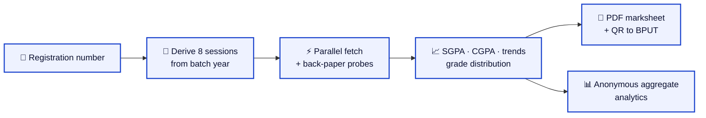

**What this project is not:** an official source, a scraping service, a model that guesses missing marks, or a place where a student identifier is stored. Where a number is unknown it says so, the one state it will never render is a plausible-looking invention.

<p align="right"><sub><a href="#-table-of-contents">↑ back to top</a></sub></p>

---

<a name="features" id="features"></a>

## ✨ Features

<table>
  <tr>
    <td width="33%" valign="top">
      <h3>🔍 Zero-friction lookup</h3>
      Registration number in, results out. Sessions are computed from the batch year, so students never guess an exam session or type a date of birth.
    </td>
    <td width="33%" valign="top">
      <h3>⚡ Parallel semester fetch</h3>
      All eight semesters are requested concurrently, each rendering its own skeleton, SGPA block and subject table as it lands.
    </td>
    <td width="33%" valign="top">
      <h3>🧾 Back-paper aware</h3>
      BPUT republishes a whole semester under a later session after supplementary exams. Those republications are probed and kept as separate attempt blocks instead of silently overwriting the original.
    </td>
  </tr>
  <tr>
    <td width="33%" valign="top">
      <h3>🧮 SGPA / CGPA you can audit</h3>
      Grade points are recomputed locally from the grade table, credit-weighted, and compared against BPUT's own <code>sgpadetails.sgpa</code>. Drift beyond <code>0.01</code> is surfaced as a visible warning.
    </td>
    <td width="33%" valign="top">
      <h3>📐 Formulas on screen</h3>
      SGPA and CGPA are rendered with KaTeX from a single source of truth, so the formula shown, the formula in the PDF and the code that computes them cannot drift apart.
    </td>
    <td width="33%" valign="top">
      <h3>📄 Marksheet PDF export</h3>
      A multi-page, print-clean marksheet built with jsPDF + AutoTable, with a rasterised formula block and a QR code back to the official portal.
    </td>
  </tr>
  <tr>
    <td width="33%" valign="top">
      <h3>🎯 Target-CGPA calculator</h3>
      A reverse SGPA calculator answers the question every student actually asks: <em>what do I need this semester to hit my target CGPA?</em>
    </td>
    <td width="33%" valign="top">
      <h3>🔴 Live, in about a second</h3>
      A successful lookup writes one anonymous counter row, a Postgres trigger maintains a single aggregate row, and realtime pushes it to every open page.
    </td>
    <td width="33%" valign="top">
      <h3>📈 Measured intake, per batch year</h3>
      Students per batch year from 2012 to 2025, drawn from the census rather than from a model: the trend line is a Theil–Sen median of pairwise slopes, with the least-squares fit shown beside it so the slope can be interrogated.
    </td>
  </tr>
  <tr>
    <td width="33%" valign="top">
      <h3>🏛 College shape, not just totals</h3>
      A median college of 91 against a mean of 145.6, a Gini of 0.53, a top decile holding 36% of the population, a Lorenz curve and a histogram of college sizes, every one computed from the 1,103 per-block readings.
    </td>
    <td width="33%" valign="top">
      <h3>🤖 A census that keeps itself true</h3>
      A daily job re-checks every recorded reading, discovers batch years and colleges the grid does not carry, watches which semesters the portal serves, and turns anything new into work, with no human editing a number.
    </td>
    <td width="33%" valign="top">
      <h3>♻️ Never reads the same thing twice</h3>
      A block-and-semester pass is claimed before it is read and recorded after, and re-reading a semester replaces its rows in one transaction. A corrected census is never a doubled one.
    </td>
  </tr>
  <tr>
    <td width="33%" valign="top">
      <h3>🔐 Role-gated admin surface</h3>
      A separate <code>/admin</code> workspace for bulk operations, gated by Supabase Auth plus a <code>user_roles</code> row, with RLS behind a <code>SECURITY DEFINER</code> <code>has_role()</code> check.
    </td>
    <td width="33%" valign="top">
      <h3>📦 Bulk runner with a real queue</h3>
      Range-based batch fetching (up to 5,000 registration numbers), a single request in flight at a time, pause / resume / cancel / retry, and progress persisted to IndexedDB so a refresh resumes cleanly.
    </td>
    <td width="33%" valign="top">
      <h3>📤 CSV + ZIP-of-PDFs export</h3>
      Export a batch as CSV, or as a ZIP containing one marksheet PDF per student, generated entirely in the browser with the formula raster cached across the run.
    </td>
  </tr>
  <tr>
    <td width="33%" valign="top">
      <h3>🙈 Honest failure states</h3>
      Every upstream outcome is classified, not published, timeout, rate limited, unreachable, malformed, and rendered as its own actionable state. It never shows stale or invented data.
    </td>
    <td width="33%" valign="top">
      <h3>🧩 Legible at every width</h3>
      Figures are sized from their own container (<code>clamp()</code> over container query units), so a four-digit count in a narrow tile is smaller than the same count in a wide one and never crosses its border, verified by arithmetic over 320 px to 1440 px layouts.
    </td>
    <td width="33%" valign="top">
      <h3>🔎 Ships SEO-ready</h3>
      Per-route document head, Open Graph + Twitter cards, <code>robots.txt</code>, <code>sitemap.xml</code>, canonical URLs and JSON-LD (<code>WebSite</code>, <code>WebApplication</code>, <code>FAQPage</code>) out of the box.
    </td>
  </tr>
</table>

<p align="right"><sub><a href="#-table-of-contents">↑ back to top</a></sub></p>

---

<a name="screenshots" id="screenshots"></a>

## 📸 Screenshots

Every tile below is a **vector recreation of the live interface**, drawn from the components, design tokens and copy that actually ship in `src/`, so each stays razor-sharp at any zoom and costs a few kilobytes instead of megabytes. Prefer a real capture? The swap instructions sit under the gallery.

<table>
  <tr>
    <td width="50%" align="center">
      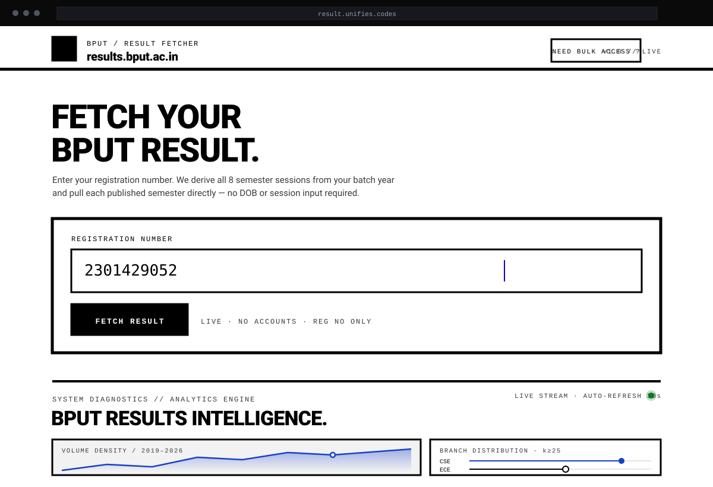
      <br/>
      <sub><b>🖥 Desktop</b> · 1440×900 · headline, registration-number form, analytics below the fold</sub>
    </td>
    <td width="50%" align="center">
      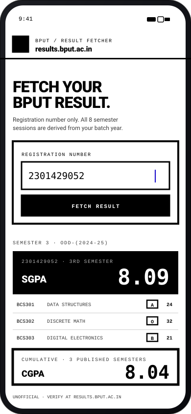
      <br/>
      <sub><b>📱 Mobile</b> · 390×844 · one column, thumb-reachable actions</sub>
    </td>
  </tr>
  <tr>
    <td width="50%" align="center">
      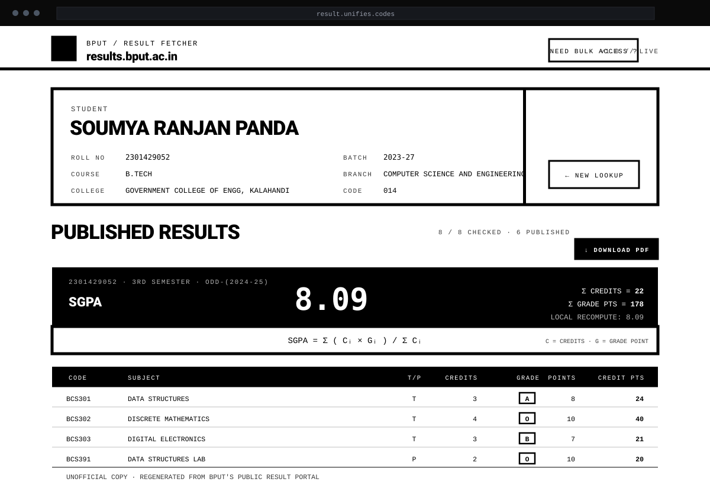
      <br/>
      <sub><b>🧾 Dashboard</b> · student card, SGPA band + formula, subject table</sub>
    </td>
    <td width="50%" align="center">
      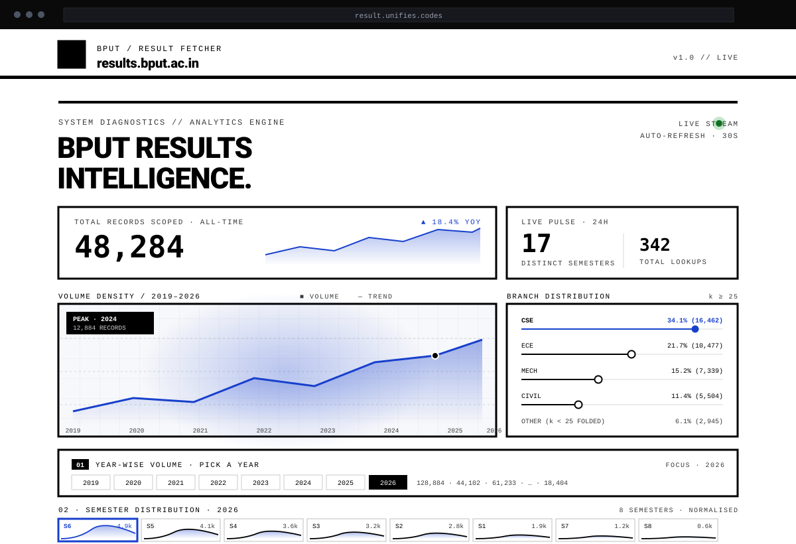
      <br/>
      <sub><b>📊 Analytics</b> · 11 panels, university and deployment labelled separately</sub>
    </td>
  </tr>
  <tr>
    <td width="50%" align="center">
      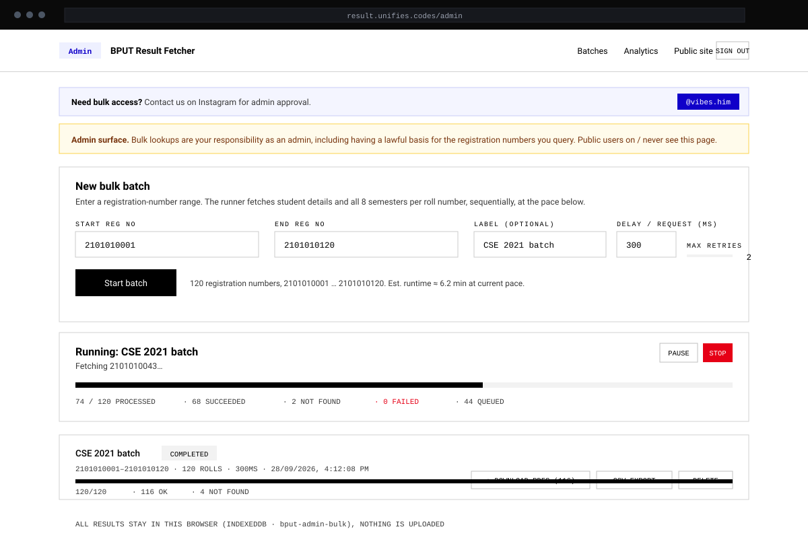
      <br/>
      <sub><b>⚙️ Settings / Admin</b> · batch form, pacing controls, exports</sub>
    </td>
    <td width="50%" align="center">
      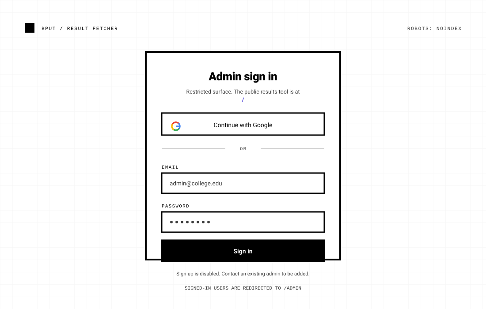
      <br/>
      <sub><b>🔑 Authentication</b> · Google + email sign-in, role-gated</sub>
    </td>
  </tr>
</table>

<details>
<summary><strong>➕ Swapping a vector tile for a real capture</strong></summary>

1. Capture at the size noted on the tile and export a PNG (keep it under ~500 KB).
2. Save it beside the vector art as `docs/screenshots/desktop.png`, `mobile.png`, `dashboard.png`, `settings.png`, `auth.png`, `analytics.png`.
3. Point that tile at the PNG instead: ``.
4. Keep the `alt` text, it is what screen-reader users receive.

```html
<table>
  <tr>
    <td width="50%" align="center">
      
      <br /><sub><b>Desktop</b></sub>
    </td>
    <td width="50%" align="center">
      
      <br /><sub><b>Mobile</b></sub>
    </td>
  </tr>
</table>
```

Vector or raster, always reference **repo-relative** paths (`docs/screenshots/…`) rather than `raw.githubusercontent.com` URLs: relative paths resolve for anyone with repository access, including in a private repository, and they survive a default-branch rename.

</details>

<p align="center">
  
</p>

<p align="right"><sub><a href="#-table-of-contents">↑ back to top</a></sub></p>

---

<a name="demo" id="demo"></a>

## 🎥 Demo

<p align="center">
  <a href="https://result.unifies.codes"></a>
</p>

Try it with any 8–12 digit registration number belonging to a BPUT batch whose results are published. Nothing to install, no account, no data retention.

### The 60-second tour

|     | Step                 | What you'll see                                                                                |
| --- | -------------------- | ---------------------------------------------------------------------------------------------- |
| 01  | Enter a reg no       | Validation, then a live fetch of the master record (name, batch, branch, college)                |
| 02  | Watch the semesters  | Eight parallel semester blocks resolving from skeletons to SGPA blocks                           |
| 03  | Read the numbers     | Per-semester SGPA, credit totals, the KaTeX formula, and a running credit-weighted CGPA band     |
| 04  | Inspect the trends   | SGPA trend line, grade distribution, and the reverse calculator for a target CGPA                |
| 05  | Download the PDF     | A multi-page marksheet with a QR code back to `results.bput.ac.in`                               |
| 06  | Scroll to analytics  | 11 panels: measured university intake first, then this deployment's own live telemetry           |

<details>
<summary><strong>🎬 Embedding a GIF / MP4 / YouTube walkthrough</strong></summary>

No recording is committed to this repository yet, and the README does not pretend otherwise, the block below is the exact markup to drop in once there is one.

**GIF**, record with [Kap](https://getkap.co) or [ScreenToGif](https://www.screentogif.com), keep it under 5 MB, and place it at `docs/demo.gif`:

```html
<p align="center">
  
</p>
```

**MP4**, GitHub renders `<video>` in Markdown; host the file in the repo or on a CDN:

```html
<video src="docs/demo.mp4" controls muted playsinline width="720"></video>
```

**YouTube**, link the thumbnail to the video, never autoplay:

```html
<p align="center">
  <a href="https://youtu.be/VIDEO_ID">
    
  </a>
</p>
```

</details>

<p align="right"><sub><a href="#-table-of-contents">↑ back to top</a></sub></p>

---

<a name="architecture" id="architecture"></a>

## 🏗 Architecture

One TanStack Start application serves both the student-facing pages and the server functions that proxy BPUT, so there is no separate backend service to deploy. Supabase holds authentication, roles, aggregate analytics and the census ledger. The census itself runs in GitHub Actions, because a crawl that needs somebody's browser tab open is not autonomous.

```mermaid
flowchart TB
  subgraph Client["🧑‍🎓 Student / admin browser"]
    UI["TanStack Router pages<br/>/ · /privacy · /auth · /admin"]
    MEM["In-memory result cache<br/>(per tab, never persisted)"]
    IDB[("IndexedDB · bput-admin-bulk<br/>bulk batches + results")]
  end

  subgraph Server["⚙️ TanStack Start server (Nitro)"]
    SSR["SSR shell + error boundary"]
    MW["Supabase auth middleware"]
    SF["Server functions<br/>fetchStudentDetails · fetchSubjects<br/>fetchResultList · getMyRoles"]
  end

  subgraph Upstream["🏛️ results.bput.ac.in (public, undocumented)"]
    U1["POST /student-detsils-results"]
    U2["POST /student-results-subjects-list"]
    U3["POST /student-results-list"]
  end

  subgraph Supabase["🗄️ Supabase"]
    AUTH["Auth · Google + email"]
    ROLES[("user_roles<br/>+ has_role()")]
    EVENTS[("analytics_events<br/>+ analytics_live (realtime)")]
    CENSUS[("bput_census_events<br/>anonymous student-semester rows")]
    LEDGER[("census_block_walk<br/>census_pass<br/>census_session_watch")]
    RPC["log_result_events · get_results_analytics<br/>log_census_events · get_bput_census<br/>census_plan · census_next_work"]
  end

  subgraph Automation["🤖 GitHub Actions"]
    CRAWL["census.yml<br/>slice every 5 minutes"]
    REFRESH["census-refresh.yml<br/>daily: re-measure · discover<br/>session watch · ledger · commit"]
  end

  UI --> MEM
  UI --> IDB
  UI --> SSR
  UI --> SF
  SF --> U1
  SF --> U2
  SF --> U3
  MW --> AUTH
  MW --> ROLES
  UI --> RPC
  RPC --> EVENTS
  RPC --> CENSUS
  CRAWL --> U1
  CRAWL --> U2
  CRAWL --> CENSUS
  CRAWL --> LEDGER
  REFRESH --> U1
  REFRESH --> LEDGER
  REFRESH -.->|dispatch a slice| CRAWL

  classDef client fill:#eef2ff,stroke:#1740cc,stroke-width:2px,color:#0b1030
  classDef server fill:#0f172a,stroke:#3b6bff,stroke-width:2px,color:#ffffff
  classDef upstream fill:#fff7ed,stroke:#f38500,stroke-width:2px,color:#3a2a00
  classDef data fill:#ecfdf5,stroke:#008b1d,stroke-width:2px,color:#052e16
  classDef auto fill:#fdf2f8,stroke:#c026d3,stroke-width:2px,color:#3b0764
  class UI,MEM,IDB client
  class SSR,MW,SF server
  class U1,U2,U3 upstream
  class AUTH,ROLES,EVENTS,CENSUS,LEDGER,RPC data
  class CRAWL,REFRESH auto
```

### Lookup flow

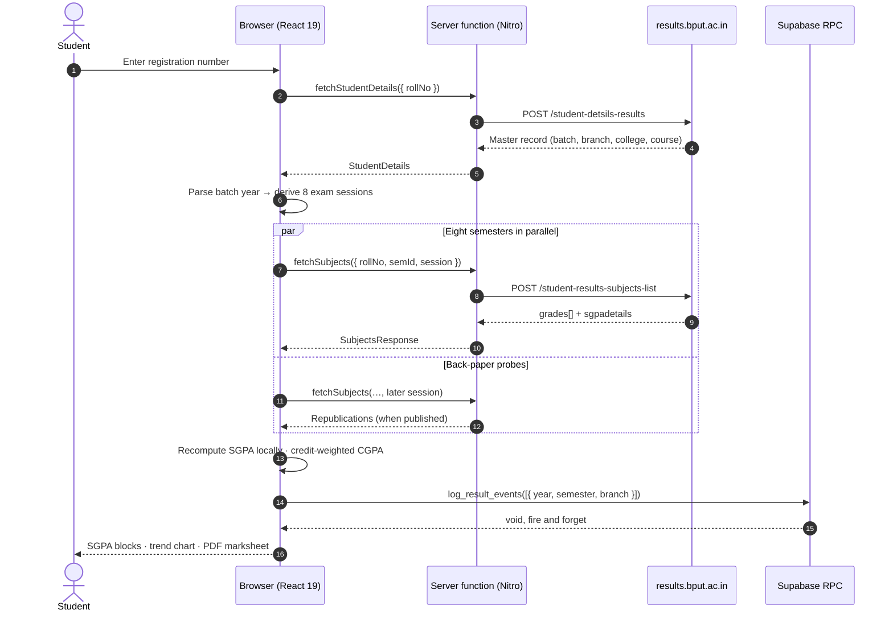

### Census flow, the part that maintains itself

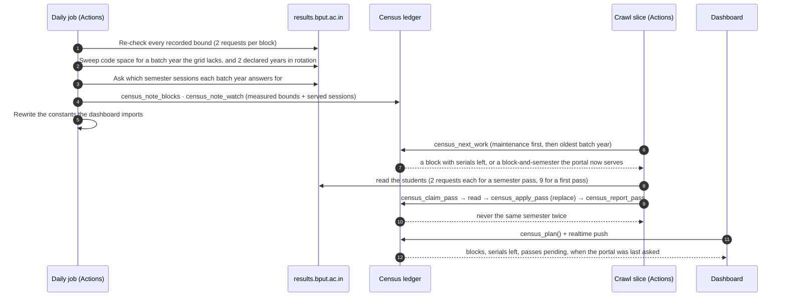

### Data model

Server-side objects, in full. None of them can hold a student identifier.

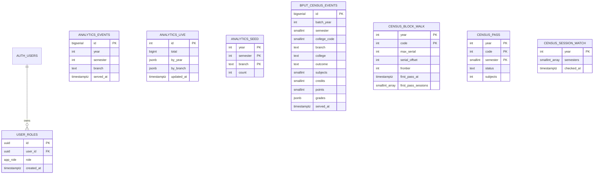

| Object                                 | Kind                                     | Role                                                                                                                   |
| -------------------------------------- | ---------------------------------------- | ---------------------------------------------------------------------------------------------------------------------- |
| `public.user_roles`                    | table (RLS)                              | One row per user role. Users read only their own row; insertions are privileged.                                        |
| `public.has_role(uid, role)`           | function · `SECURITY DEFINER`            | Role check that avoids RLS recursion. Execute revoked from `anon`/`authenticated`, granted to `service_role`.            |
| `public.analytics_events`              | table (RLS)                              | One row per successful lookup: year, semester, branch, timestamp. No identifiers, ever.                                  |
| `public.analytics_live`                | table (RLS) + realtime                   | One aggregate row a trigger maintains; the dashboard subscribes to it, so a lookup on one phone moves the number on every open page. |
| `public.analytics_seed`                | table (RLS)                              | Seeded historical counters so the charts are meaningful on day one.                                                     |
| `public.log_result_events(…)`          | function · `SECURITY DEFINER`            | Anonymous, clamped, fire-and-forget writer used by the browser.                                                          |
| `public.get_results_analytics()`       | function · `STABLE`, `SECURITY DEFINER`  | Returns the single JSON payload the deployment-telemetry panels consume, applying k = 25 to branch buckets.               |
| `public.bput_census_events`            | table (RLS, service-role writes)         | One anonymous row per student-semester the census read: batch year, semester, branch, credits and grade totals. No roll number, no name, no date of birth. |
| `public.census_block_walk`             | table (RLS, service-role only)           | Per-block state: measured bound, walk offset, the highest serial that answered (`frontier`), and which semesters the first pass captured. |
| `public.census_pass`                   | table (RLS, service-role only)           | One block and one semester, claimed before it is read, closed after. This is what makes a re-read impossible to double-count. |
| `public.census_session_watch`          | table (RLS, service-role only)           | Which semester sessions the portal last answered for, per batch year. Written by the daily job, not by a constant.        |
| `public.census_work`                   | view (service-role only)                 | Outstanding work, derived: blocks with serials left, plus block-and-semester passes for sessions the portal serves.       |
| `public.census_plan()`                 | function · `SECURITY DEFINER` (anon read) | Counts only, blocks, blocks done, serials left, passes pending, when the portal was last asked. The dashboard's source.  |

### Deployment topology

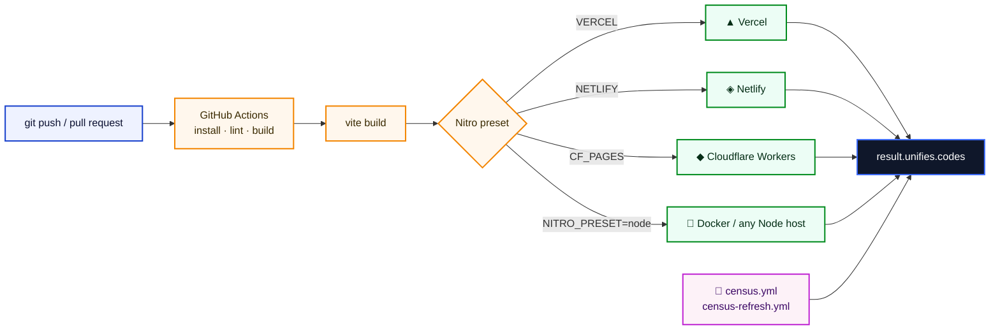

> [!NOTE]
> Nitro detects the target platform from the host's own environment variables (`VERCEL`, `NETLIFY`, `CF_PAGES`, …), so the same `bun run build` produces the right artifact everywhere. Locally, with none of those set, it falls back to a Cloudflare Workers bundle.

<p align="right"><sub><a href="#-table-of-contents">↑ back to top</a></sub></p>

---

<a name="results-intelligence" id="results-intelligence"></a>

## 📈 Results Intelligence

The dashboard is deliberately split in two, and every panel says which side it is on. **Panels 01–03 describe the university**, properties of BPUT's own registration numbering. **Panels 04–11 describe this deployment**, traffic this site actually served. Blending the two would let a figure about a university read as a figure about a website, which is the mistake this split exists to prevent.

### The measured universe

BPUT publishes no documentation of its numbering, so this project derived it by probing the portal and wrote down the evidence. A registration number is `YY 01 CCC SSS`: admission year, a constant `01` for B.Tech, the college code, then a serial within that college's intake.

| Batch year | Colleges measured | Registration numbers | Median college | Largest college |
| ---------- | ----------------- | -------------------- | -------------- | --------------- |
| 2012       | 82                | 18,208               | 150            | 998             |
| 2013       | 83                | 15,262               | 118            | 959             |
| 2014       | 87                | 12,274               | 93             | 679             |
| 2015       | 90                | 14,966               | 117            | 796             |
| 2016       | 85                | 14,590               | 98             | 929             |
| 2017       | 81                | 10,248               | 79             | 543             |
| 2018       | 77                | 8,208                | 81             | 431             |
| 2019       | 76                | 8,693                | 77             | 502             |
| 2020       | 73                | 7,231                | 73             | 532             |
| 2021       | 72                | 8,617                | 84             | 522             |
| 2022       | 73                | 9,819                | 106            | 623             |
| 2023       | 71                | 8,974                | 77             | 590             |
| 2024       | 73                | 10,874               | 83             | 686             |
| 2025       | 80                | 12,645               | 90             | 714             |
| **Total**  | **1,103**         | **160,609**          |,              |,               |

Measured 2026-09-29, block by block, by binary-searching each range for its last live serial (about 17 requests per block). Holes were quantified by walking 22 ranges serial by serial: **3.4%** of serials below the maximum are missing in the 2012–2014 batches and **0.42%** from 2015 on, which puts the grid at about **158,571 students** rather than the 160,609 numbers it declares. Full evidence, including the audits and their drift, is committed at `docs/census-intake.json`.

What the measurement says is unflattering and is printed anyway: intake peaks at 17,589 students in 2012, troughs at 7,201 in 2020, has recovered 74.9% since, and is still **−28.4%** across the whole span, a Theil–Sen median slope of **−462.5 students a year** (least-squares −458.1, R² 0.38). Intake figures are the portal's numbering standing in for cohort size, which makes every student count here an upper bound, and the panels say so.

### The census does not end

A one-off measurement becomes a stale claim the moment BPUT publishes anything. So the census is a loop with four moving parts, and none of them needs a human:

| Trigger                                                        | Becomes work by itself                                          | Cost                        |
| -------------------------------------------------------------- | --------------------------------------------------------------- | --------------------------- |
| A **semester the portal now serves** that a block has not read   | The session watch records it; the ledger turns it into a pass     | 2 reads per student         |
| A **finished block that grew** (late admission, re-publication)  | Its measured bound moves past the read frontier                  | a normal walk               |
| A **served-but-unpassed semester** nobody has read yet           | Re-checked monthly rather than assumed, because results are published in batches | 2 reads per student |
| A **new batch year** or a **college that opens a batch**         | The daily sweep probes code space, validates the answer against the record it gets back, measures the block and appends it to the grid | ~600 probes + 17 per block |

**Nothing is read twice.** A pass is claimed before it is read and closed after; re-reading a semester *replaces* that block's rows inside one transaction (raising if a short write would leave the delete uncommitted); and a block-semester already captured is never claimed again. Four invariants are checked on every daily run, and any of them can fail the job:

- no semester read twice;
- no walk past a measured bound;
- no finished block without a read position;
- no served semester stranded with nothing queued to read it.

The dashboard's "reads left" is the sum of what is spent and what is outstanding, both read from the ledger, so it **rises** on the day the portal publishes something new, instead of counting down to zero and staying there. Where the ledger is not available the panel falls back to the baseline measurement and labels itself as doing so.

### Where the numbers come from

| Layer                      | Source                                                                                          |
| -------------------------- | ----------------------------------------------------------------------------------------------- |
| University figures (01–03) | `src/lib/census-blocks.ts`, constants re-derived daily from `docs/census-intake.json`            |
| Deployment figures (04–11) | `analytics_events` / `analytics_live` via `get_results_analytics()`, k = 25 floor applied          |
| Live counters              | A realtime subscription to `analytics_live` and the census status channel                          |
| Coverage and remaining work | `census_plan()`, derived from the ledger, never from a compiled constant                          |

<p align="right"><sub><a href="#-table-of-contents">↑ back to top</a></sub></p>

<p align="center">
  
</p>

---

<a name="tech-stack" id="tech-stack"></a>

## 🛠 Tech Stack

Every entry below is verified against `package.json`, `vite.config.ts` and the source tree, no aspirational logos.

**Frontend**

<p>
  
  
  
  
  
  
  
  
  
  
  
  
</p>

**Backend & Runtime**

<p>
  
  
  
  
  
  
  
</p>

**Database, Auth & Storage**

<p>
  
  
  
</p>

**Cloud & DevOps**

<p>
  
  
  
  
  
</p>

**Documents, Math & Data Viz**

<p>
  
  
  
  
  
</p>

**Quality & Tooling**

<p>
  
  
  
  
</p>

> [!TIP]
> **AI/ML:** there is intentionally none. Every number in this app is deterministic arithmetic on published grades, SGPA is credit-weighted grade points, CGPA the same weighted across semesters, or a count of things that were actually fetched. No model, no inference, nothing to hallucinate. If that changes, it will be documented here rather than implied with a badge.

<p align="right"><sub><a href="#-table-of-contents">↑ back to top</a></sub></p>

---

<a name="quick-start" id="quick-start"></a>

## ⚡ Quick Start

### Prerequisites

| Requirement                                                                    | Why                                                                              |
| ------------------------------------------------------------------------------ | -------------------------------------------------------------------------------- |
| [Node.js](https://nodejs.org) **20+** (CI uses 22)                              | TanStack Start, Vite 8 and the Cloudflare Workers target all expect ≥ 20.         |
| [Bun](https://bun.sh) **1.x** or **npm**                                        | Both `bun.lock` and `package-lock.json` are committed, pick one and stay on it.  |
| [Supabase](https://supabase.com) project **or** Supabase CLI + Docker           | Only for analytics, `/admin` and the census ledger. The public flow needs neither. |
| [Docker Desktop](https://www.docker.com/products/docker-desktop/) *(optional)*   | Only if you want a fully local Supabase stack instead of a hosted project.         |

### Installation

```bash
# 1, clone
git clone https://github.com/flawsom/result.git
cd result

# 2, install (bun recommended; npm works identically)
bun install
# npm install

# 3, run
bun run dev
# → http://localhost:5173
```

The homepage, live result lookup, trend charts and PDF export work with an **empty `.env`**. Only the "BPUT Results Intelligence" section needs Supabase, and it degrades to a clear "Analytics unavailable" message, never a broken page.

### Environment variables

```bash
cp .env.example .env
```

The public student flow needs **nothing**. To enable analytics, `/admin` and the census tooling, fill in the Supabase values exactly as described in [Environment Variables](#-environment-variables).

### Available scripts

| Script                | Command                                     | Description                                                                                       |
| --------------------- | ------------------------------------------- | ------------------------------------------------------------------------------------------------- |
| `dev`                 | `vite dev`                                  | Dev server on `http://localhost:5173` with HMR                                                      |
| `build`               | `vite build`                                | Production build; Nitro picks the preset from the deploying platform                                |
| `build:dev`           | `vite build --mode development`             | Development-mode build including the SSR prerender pass, useful for reproducing SSR errors locally |
| `preview`             | `vite preview`                              | Serves the build output. For Nitro output use `npx nitro preview`                                   |
| `lint`                | `eslint .`                                  | Lint the whole repository                                                                           |
| `format`              | `prettier --write .`                        | Format every file with the project's Prettier config                                                |
| `census:intake`       | `bun scripts/census-intake.mjs`             | Measure every block's highest live serial, and record the evidence                                  |
| `census:discover`     | `bun scripts/census-intake.mjs --discover`  | Ask the portal what the grid is missing, a new batch year, a college that opened a batch           |
| `census:refresh`      | `bun scripts/census-intake.mjs --refresh --write-constants` | Re-check every recorded reading and re-derive the constants the dashboard imports   |
| `census:sessions`     | `bun scripts/census-sessions.mjs`           | Ask which semester sessions the portal answers for, per batch year                                   |
| `census:ledger`       | `bun scripts/census-ledger.mjs --verify`    | Publish the measurement to the ledger and check its invariants                                       |
| `census:status`       | `bun scripts/census-status.mjs`             | Re-zip the evidence against the embedded readings; throws on any disagreement                        |
| `census:verify`       | `bun scripts/census-verify.mjs`             | Check that a *deployed* build really reads the census it claims to                                    |
| `census:sentinel-test`| `bun scripts/census-sentinel-test.mjs`      | Prove the stranded-semester sentinel fires, and stays quiet otherwise                                 |
| `census:tick`         | `bun scripts/census-tick.mjs`               | Run one crawl slice (the same entry point GitHub Actions uses)                                        |
| `census:key`          | `bun scripts/check-credentials.mjs`         | Name and validate a Supabase key without printing it                                                  |
| `analytics:status`    | `bun scripts/analytics-status.mjs`          | Tell a quiet live counter from a broken one (`--probe` performs one real lookup)                       |

### Running locally

```bash
bun run dev            # dev server, HMR, http://localhost:5173
bun run lint           # eslint
bun tsc -b --noEmit    # type check without emitting
bun x prettier --check src scripts
```

### Docker setup

The Nitro `node` preset produces a self-contained server bundle in `.output/`. Build the app, then package the output:

```dockerfile
# ---------- build ----------
FROM node:22-alpine AS build
WORKDIR /app
COPY package*.json ./
RUN npm ci
COPY . .
ENV NITRO_PRESET=node
RUN npm run build

# ---------- run ----------
FROM node:22-alpine AS runtime
WORKDIR /app
ENV NODE_ENV=production
ENV PORT=3000
COPY --from=build /app/.output ./.output
EXPOSE 3000
CMD ["node", ".output/server/index.mjs"]
```

```bash
docker build -t bput-result-fetcher .
docker run --rm -p 3000:3000 --env-file .env bput-result-fetcher
# → http://localhost:3000
```

> [!WARNING]
> Never bake secrets into the image. `VITE_*` values are inlined into the client bundle at build time, so pass them as build arguments **only** if they are genuinely public (the Supabase URL and publishable key are). `SUPABASE_SERVICE_ROLE_KEY` must stay runtime-only and server-side.

### Production deployment

```bash
NITRO_PRESET=vercel bun run build      # or netlify / cloudflare-pages / node
```

See [Deployment](#-deployment) for platform-by-platform instructions.

<p align="right"><sub><a href="#-table-of-contents">↑ back to top</a></sub></p>

---

<a name="project-structure" id="project-structure"></a>

## 📁 Project Structure

```text
result/
├── .github/workflows/
│   ├── ci.yml                      # install → lint → build, on pushes and PRs to main
│   ├── census.yml                  # the crawl: one slice per trigger, resumed from the ledger
│   └── census-refresh.yml          # daily: re-check readings, discover, session watch, ledger, commit
├── docs/
│   ├── census-intake.json          # the measurement: every block's reading + the audits
│   ├── census-sessions.json        # what the portal served, per batch year, per day checked
│   ├── census-automation.json      # heartbeat: did the daily job actually run
│   ├── hero.svg · divider.svg      # the art at the top of this README
│   └── screenshots/*.svg           # vector recreations of the interface
├── public/                         # Static assets served from the site root
│   ├── favicon.ico
│   ├── og-image.png / .svg         # 1200×630 Open Graph + Twitter card artwork
│   ├── robots.txt                  # Allows all crawlers, disallows /admin, references the sitemap
│   └── sitemap.xml
├── scripts/                        # Bun entry points: measurement, discovery, crawl, verification
│   ├── census-intake.mjs           # --refresh · --discover · --write-constants · --audit K
│   ├── census-sessions.mjs         # generates src/lib/census-session-watch.ts
│   ├── census-ledger.mjs           # publishes the universe, verifies four invariants
│   ├── census-sentinel-test.mjs    # proves the sentinel can fire, against crafted ledgers
│   ├── census-status.mjs           # re-zips the evidence against the embedded readings
│   ├── census-verify.mjs           # checks a deployed build really reads the census
│   ├── census-tick.mjs · census-heartbeat.mjs · census-manifest.mjs
│   └── analytics-status.mjs · check-credentials.mjs
├── src/
│   ├── components/
│   │   ├── HomeAnalytics.tsx        # mounts the 11 panels, streams both live channels
│   │   ├── BputCensus.tsx           # the landing page's census section
│   │   ├── analytics/
│   │   │   ├── figure.ts            # figureStyle(): size a figure from its own container
│   │   │   ├── panels.tsx           # panel 04-11 primitives: KpiTile, StatBox, MeterRow, PanelCard
│   │   │   └── university.tsx       # panels 01-03: measured intake, college shape, coverage & yield
│   │   ├── SgpaTrendChart.tsx · GradeDistributionChart.tsx · ReverseSgpaCalc.tsx
│   │   ├── ResultStates.tsx         # not-published / error / retry states
│   │   └── ui/                      # shadcn/ui primitives (new-york style, Radix-based)
│   ├── integrations/supabase/
│   │   ├── client.ts                # browser client (handles new sb_publishable_ opaque keys)
│   │   ├── client.server.ts         # server / service-role client
│   │   ├── auth-attacher.ts · auth-middleware.ts
│   │   └── types.ts                 # hand-declared database types (see the header for why)
│   ├── lib/
│   │   ├── bput-upstream.ts         # the only module that talks to results.bput.ac.in
│   │   ├── bput.functions.ts        # server functions + the error taxonomy
│   │   ├── census-blocks.ts         # the measured grid: declared lists + the discovered overlay
│   │   ├── census-discovered.ts     # generated, blocks discovery found on its own
│   │   ├── census-core.ts           # observation model, rate governor, semester readers
│   │   ├── census-headless.ts       # the crawl: first pass + maintenance passes
│   │   ├── census-runner.ts         # the same work, driven from a page
│   │   ├── census-client.ts         # census RPCs + the shared realtime channel
│   │   ├── census-session-watch.ts  # generated, sessions the portal serves
│   │   ├── intake-stats.ts          # panels 01-03 math, including the ledger-aware acquisition
│   │   ├── analytics-client.ts · analytics-stats.ts
│   │   ├── sgpa.ts · formulas.ts    # the single source of truth for the math
│   │   ├── pdf.ts                   # jsPDF marksheet: layout, MathJax→PNG formulas, QR, disclaimers
│   │   ├── result-cache.ts          # in-memory, per-tab cache (never persisted)
│   │   ├── admin.functions.ts · devtools-guard.ts · error-*.ts · utils.ts
│   │   └── bulk/                    # admin bulk engine (entirely client-side)
│   │       ├── db.ts · runner.ts · range.ts · sessions.ts · analytics.ts · export.ts
│   ├── routes/
│   │   ├── __root.tsx               # app shell: providers, document head, JSON-LD, error boundaries
│   │   ├── index.tsx                # public lookup: search, semesters, CGPA, charts, PDF, analytics
│   │   ├── privacy.tsx              # privacy, disclaimer and FAQ (with FAQPage JSON-LD)
│   │   ├── auth.tsx · auth.callback.tsx
│   │   └── _authenticated/          # role-gated /admin layout, batches and analytics
│   ├── routeTree.gen.ts             # auto-generated, never edit by hand
│   ├── server.ts · start.ts         # SSR entry and server-function middleware
│   └── styles.css                   # Tailwind v4 entry, design tokens, dark mode
├── supabase/migrations/             # append-only, timestamped SQL
├── components.json · eslint.config.js · .prettierrc · bunfig.toml · tsconfig.json
└── vite.config.ts                   # thin wrapper over @lovable.dev/vite-tanstack-config
```

<p align="right"><sub><a href="#-table-of-contents">↑ back to top</a></sub></p>

---

<a name="environment-variables" id="environment-variables"></a>

## 🔐 Environment Variables

The public lookup flow reads **no** environment variables at all. The values below are required for the analytics dashboard, for `/admin`, and for the census tooling. Nothing here is ever needed by a student's browser, and no key is ever committed, this repository's `.env` is ignored.

| Variable                        | Scope            | Required                      | Description                                                                                                          |
| ------------------------------- | ---------------- | ----------------------------- | -------------------------------------------------------------------------------------------------------------------- |
| `VITE_SUPABASE_URL`             | Client (browser) | Analytics + `/admin`          | Supabase project URL used by the browser client.                                                                      |
| `VITE_SUPABASE_PUBLISHABLE_KEY` | Client (browser) | Analytics + `/admin`          | Publishable / anon key used by the browser client. Safe to expose.                                                     |
| `VITE_SUPABASE_PROJECT_ID`      | Client (browser) | Analytics + `/admin`          | Project ref, used to derive storage keys.                                                                              |
| `SUPABASE_URL`                  | Server           | Analytics + `/admin` + census | Same URL, read inside server functions, the auth middleware and every script. Also the SSR fallback for the browser client. |
| `SUPABASE_PUBLISHABLE_KEY`      | Server           | Analytics + `/admin`          | Publishable key read by the auth middleware. Also the SSR fallback for the browser client.                              |
| `SUPABASE_PROJECT_ID`           | Server           | Analytics + `/admin`          | Project ref for server-side helpers.                                                                                   |
| `SUPABASE_SERVICE_ROLE_KEY`     | Server only      | Census jobs + migrations      | Bypasses RLS. Required by the crawl and the daily refresh (as GitHub secrets), and by nothing in the browser. **Never** prefix it with `VITE_`. |

<details>
<summary><strong>⚠️ Things that bite people</strong></summary>

- **Server and client values must match**, same project, same key. Vite only exposes `VITE_`-prefixed variables to the browser bundle, so both sets exist on purpose.
- **Never** name the service-role key `VITE_SUPABASE_SERVICE_ROLE_KEY`. That ships a privileged key to every visitor.
- New-style `sb_publishable_…` keys are opaque, not JWTs. Always import the provided clients (`@/integrations/supabase/client` for the browser, `@/integrations/supabase/auth-middleware` on the server) rather than calling `createClient` by hand, or PostgREST rejects the request with `Expected 3 parts in JWT; got 1`.
- An opaque key must be sent as `apikey` **only**, sending it as `Authorization: Bearer` makes the gateway reject it. Every script here does this for you.
- The census crawls from GitHub Actions, so the two repository secrets are `SUPABASE_URL` and `SUPABASE_SERVICE_ROLE_KEY` (Settings → Secrets and variables → Actions). Without them the crawl logs a notice and does nothing, rather than failing in a confusing way.

</details>

<details>
<summary><strong>🧩 Minimal local <code>.env</code> (hosted Supabase)</strong></summary>

```env
SUPABASE_PROJECT_ID="abcdefghijklm"
SUPABASE_URL="https://abcdefghijklm.supabase.co"
SUPABASE_PUBLISHABLE_KEY="sb_publishable_..."

VITE_SUPABASE_PROJECT_ID="abcdefghijklm"
VITE_SUPABASE_URL="https://abcdefghijklm.supabase.co"
VITE_SUPABASE_PUBLISHABLE_KEY="sb_publishable_..."
```

```bash
# apply the schema
supabase link --project-ref abcdefghijklm
supabase db push
```

</details>

<details>
<summary><strong>🐳 Minimal local <code>.env</code> (Supabase CLI + Docker)</strong></summary>

```env
SUPABASE_PROJECT_ID="local"
SUPABASE_URL="http://127.0.0.1:54321"
SUPABASE_PUBLISHABLE_KEY="<anon key printed by `supabase start`>"

VITE_SUPABASE_PROJECT_ID="local"
VITE_SUPABASE_URL="http://127.0.0.1:54321"
VITE_SUPABASE_PUBLISHABLE_KEY="<same key>"
```

```bash
supabase start        # boots Postgres, Auth, PostgREST and applies ./supabase/migrations
supabase stop         # data persists; add --no-backup to wipe
```

</details>

### Google OAuth

The "Continue with Google" button calls Supabase's Google provider directly, there is no third-party OAuth broker and **no** `GOOGLE_CLIENT_ID` / `GOOGLE_CLIENT_SECRET` in this repository. All Google configuration lives in the Supabase dashboard.

1. Google Cloud Console → **Credentials → OAuth client ID → Web application**. Add your origins (`http://localhost:5173`, your production domain).
2. Add exactly one authorised redirect URI: `https://<project-ref>.supabase.co/auth/v1/callback`, Supabase's callback, not your app's.
3. Supabase → **Authentication → Providers → Google**: paste the client ID and secret.
4. Supabase → **Authentication → URL Configuration**: set the site URL and allowlist every `${origin}/auth/callback` you sign in from.

<details>
<summary><strong>Auth troubleshooting</strong></summary>

| Symptom                                         | Cause / fix                                                                                          |
| ----------------------------------------------- | ---------------------------------------------------------------------------------------------------- |
| `redirect_uri_mismatch` from Google             | The exact `https://<ref>.supabase.co/auth/v1/callback` URL is missing from the Google OAuth client.   |
| Landed back on `/auth` after Google             | Your `${origin}/auth/callback` is missing from Supabase's redirect allowlist.                          |
| `Unsupported provider: provider is not enabled` | The Google provider is not enabled in Supabase → Authentication → Providers.                           |
| Signed in, but `/admin` shows "Not authorized"  | Expected, insert a `user_roles` row for that user with `role = 'admin'`.                             |
| `404` on an `/~oauth/*` path                    | You are on an old build that used an OAuth broker. Pull latest, the app talks to Supabase directly.   |

</details>

<p align="right"><sub><a href="#-table-of-contents">↑ back to top</a></sub></p>

---

<a name="documentation" id="documentation"></a>

## 📖 Documentation

| Topic                          | Where                                                                                                    |
| ------------------------------ | -------------------------------------------------------------------------------------------------------- |
| Route conventions              | [`src/routes/README.md`](src/routes/README.md), TanStack file-based routing rules                        |
| Server functions & error codes | [`src/lib/bput.functions.ts`](src/lib/bput.functions.ts)                                                 |
| The census grid                | [`src/lib/census-blocks.ts`](src/lib/census-blocks.ts), the numbering rules, with the evidence beside them |
| The census design              | [`supabase/migrations/`](supabase/migrations), the ledger, the view, and why each rule exists             |
| Measurement evidence           | [`docs/census-intake.json`](docs/census-intake.json), every reading, plus 22 full-walk audits             |
| Grade points & SGPA math       | [`src/lib/sgpa.ts`](src/lib/sgpa.ts) · [`src/lib/formulas.ts`](src/lib/formulas.ts)                        |
| PDF marksheet layout           | [`src/lib/pdf.ts`](src/lib/pdf.ts)                                                                        |
| Analytics RPC schema           | [`supabase/migrations/`](supabase/migrations)                                                             |
| Bulk engine                    | [`src/lib/bulk/`](src/lib/bulk)                                                                           |
| Environment template           | [`.env.example`](.env.example)                                                                            |
| Contributing guardrails        | `main` must always stay deployable, it deploys on every push                                             |
| Privacy & FAQ (user-facing)    | [`/privacy`](https://result.unifies.codes/privacy)                                                        |

$$ \text{SGPA} = \frac{\sum_{i=1}^{n} C_i \times G_i}{\sum_{i=1}^{n} C_i} \qquad\qquad \text{CGPA} = \frac{\sum_{n=1}^{k} \text{SGPA}_n \times C_n}{\sum_{n=1}^{k} C_n} $$

Grade points follow BPUT's scheme: `O 10`, `E 9`, `A 8`, `B 7`, `C 6`, `D 5`, and `F` (fail), `M` (malpractice) and `S` (absent) all worth `0`.

<p align="right"><sub><a href="#-table-of-contents">↑ back to top</a></sub></p>

---

<a name="api-reference" id="api-reference"></a>

## 🔌 API Reference

There is no hand-written REST API to maintain. The surface is **typed server functions** (TanStack Start RPC, same-origin) plus **Supabase RPCs** called from the browser or from the census jobs in Actions. The upstream BPUT endpoints are undocumented and are never called directly from a client.

**Base URL** for everything below: `https://<project-ref>.supabase.co/rest/v1/rpc/<function>` · **Auth**: the publishable key as `apikey`, except the census writes, which require the service role.

### Error taxonomy

Every upstream failure is re-thrown with a stable prefix so the UI can branch on category across the server-function boundary.

| Code                 | Meaning                                            | Retried?             |
| -------------------- | -------------------------------------------------- | -------------------- |
| `BPUT_NOT_PUBLISHED` | BPUT has not published this result yet              | No                   |
| `BPUT_BAD_INPUT`     | Registration number / session / semester malformed  | No                   |
| `BPUT_RATE_LIMITED`  | Upstream returned `429` (respects `Retry-After`)    | Once, then surfaced  |
| `BPUT_TIMEOUT`       | Upstream exceeded the 7 s `AbortController` budget  | Once, after 400 ms   |
| `BPUT_UNREACHABLE`   | Network failure                                     | Once, after 400 ms   |
| `BPUT_UPSTREAM`      | `5xx` or a non-JSON body                            | `5xx` only           |

### Server functions

| Function              | Method | Input                        | Returns                                                  |
| --------------------- | ------ | ---------------------------- | -------------------------------------------------------- |
| `fetchStudentDetails` | POST   | `{ rollNo: string }`          | `StudentDetails`, name, batch, branch, college           |
| `fetchSubjects`       | POST   | `{ rollNo, semId, session }`  | `SubjectsResponse`, `grades[]` + `sgpadetails`            |
| `fetchResultList`     | POST   | `{ rollNo, dob, session }`    | `ResultListItem[]`, published semesters for a session    |
| `getMyRoles`          | GET    |, (requires a session)        | `string[]` of roles for the signed-in user                 |

```ts
import { useServerFn } from "@tanstack/react-start";
import { fetchStudentDetails, fetchSubjects } from "@/lib/bput.functions";

const getDetails = useServerFn(fetchStudentDetails);

// 1. master record
const student = await getDetails({ data: { rollNo: "2301429052" } });

// 2. one semester
const subjects = await useServerFn(fetchSubjects)({
  data: { rollNo: student.rollNo, semId: "3", session: "Odd-(2024-25)" },
});
```

Example response (abridged):

```json
{
  "grades": [
    {
      "semester": "3RD SEMESTER",
      "semId": "3",
      "subjectCODE": "BCS301",
      "subjectTP": "T",
      "subjectName": "DATA STRUCTURES",
      "subjectCredits": 3,
      "grade": "A",
      "points": 8,
      "creditPoints": 24,
      "recheck": 0
    }
  ],
  "sgpadetails": { "cretits": 22, "totalGradePoints": 178, "sgpa": "8.09" }
}
```

> [!NOTE]
> `sgpadetails.cretits` is BPUT's own spelling, preserved deliberately as ground truth. The client recomputes SGPA from `grades` and flags any disagreement larger than `0.01`.

### Supabase RPCs

**Analytics, anonymous, `anon`-callable, clamped and validated server-side**

| RPC                                       | Body                              | Returns                                       |
| ----------------------------------------- | --------------------------------- | --------------------------------------------- |
| `POST /rest/v1/rpc/log_result_events`     | `{ _events: [{ year, semester, branch }] }` | `integer`, rows stored, invalid ones dropped |
| `POST /rest/v1/rpc/get_results_analytics` |,                                 | `jsonb` aggregate payload                      |

```bash
curl -s "https://$SUPABASE_PROJECT_ID.supabase.co/rest/v1/rpc/get_results_analytics" \
  -X POST \
  -H "apikey: $SUPABASE_PUBLISHABLE_KEY" \
  -H "Content-Type: application/json" \
  -d '{}' | jq '{total, pulse24hDistinct, pulse24hTotal}'
```

```json
{
  "total": 48213,
  "byYear": [{ "year": 2024, "count": 12884 }],
  "byYearSem": [{ "year": 2024, "semester": 3, "count": 2110 }],
  "byBranch": [
    { "branch": "COMPUTER SCIENCE AND ENGINEERING", "count": 9042 },
    { "branch": "Other", "count": 1180 }
  ],
  "pulse24hDistinct": 17,
  "pulse24hTotal": 342,
  "updatedAt": "2026-09-29T10:12:44.913Z"
}
```

<details>
<summary><strong>Why <code>Other</code> appears in the branch list</strong></summary>

`get_results_analytics()` folds every branch bucket with fewer than **25** total records into a single `Other` bucket before returning. That k-anonymity floor means a small or newly-opened branch can never be singled out in aggregate charts.

</details>

**Census, the crawl's own surface. Reads are `anon` where they are counts only; every write needs the service role.**

| RPC                                       | Auth        | Body                                                     | Returns                                                     |
| ----------------------------------------- | ----------- | -------------------------------------------------------- | ----------------------------------------------------------- |
| `POST /rest/v1/rpc/get_bput_census`       | `anon`      |,                                                        | `jsonb`, published coverage cells, k ≥ 25                   |
| `POST /rest/v1/rpc/census_plan`           | `anon`      |,                                                        | `jsonb`, blocks, blocks done, serials left, passes pending, when the portal was last asked |
| `POST /rest/v1/rpc/census_progress`       | `anon`      |,                                                        | `jsonb`, the crawl's own progress counters                  |
| `POST /rest/v1/rpc/census_next_work`      | service     | `{ _limit }`                                             | `jsonb`, maintenance passes first, then the oldest batch year |
| `POST /rest/v1/rpc/log_census_events`     | service     | `{ _rows: [{ … observation }] }`                          | `integer`, rows stored                                      |
| `POST /rest/v1/rpc/census_note_blocks`    | service     | `{ _rows: [{ year, code, max }] }`                        | `integer`, measured bounds published                        |
| `POST /rest/v1/rpc/census_note_watch`     | service     | `{ _rows: [{ year, semesters }] }`                        | `integer`, session-watch rows published                     |
| `POST /rest/v1/rpc/census_note_walk`      | service     | `{ _year, _code, _offset, _frontier, _captured, _completed }` | `void`, the walk's read position, with its frontier      |
| `POST /rest/v1/rpc/census_claim_pass`     | service     | `{ _year, _code, _semester }`                             | `boolean`, false if that semester was already captured       |
| `POST /rest/v1/rpc/census_apply_pass`     | service     | `{ _year, _code, _semester, _rows }`                      | `integer`, rows replaced atomically, or an error             |
| `POST /rest/v1/rpc/census_report_pass`    | service     | `{ _year, _code, _semester, _status, _subjects }`          | `void`, closes the pass as done, empty or failed             |

<details>
<summary><strong>Why <code>census_apply_pass</code> replaces instead of inserting</strong></summary>

Observations are append-only facts about student-semesters, and the table has no uniqueness constraint by design, the same fact served twice is not something Postgres can call a duplicate. A maintenance pass therefore deletes that block's rows for that one semester and rewrites the whole set inside a single transaction, raising if fewer rows landed than were sent (a short write would otherwise commit the delete). A corrected census stays a census; it never becomes a doubled one.

</details>

### Upstream (proxied, undocumented)

These are BPUT's own public endpoints. They are consumed only by the server functions and the census jobs, and are documented here so contributors understand the integration seam. Their shape can change without notice.

| Path                             | Query                        | Used by                     |
| -------------------------------- | ---------------------------- | --------------------------- |
| `/student-detsils-results`       | `rollNo`                     | lookup + census              |
| `/student-results-subjects-list` | `semid`, `rollNo`, `session`  | lookup + census              |
| `/student-results-list`          | `rollNo`, `dob`, `session`    | lookup                       |

Base: `https://results.bput.ac.in` · timeout 7,000 ms · one retry with a fixed 400 ms backoff. Note the typo in `detsils`, that is the upstream path, not ours.

<p align="right"><sub><a href="#-table-of-contents">↑ back to top</a></sub></p>

---

<a name="usage-examples" id="usage-examples"></a>

## 🎯 Usage Examples

### Look up a result in the browser

```text
1. Open https://result.unifies.codes
2. Enter your registration number, e.g. 2301429052
3. Press Enter
```

Sessions are derived from the batch year in the master record: semester _n_ maps to `year = batchStart + floor((n - 1) / 2)` and alternates `Odd` / `Even`, e.g. `Odd-(2024-25)`. Back-paper republications are probed in later sessions and shown as separate attempt blocks.

### Compute SGPA from a grade table

```ts
import { calculateSGPA, GRADE_POINTS } from "@/lib/sgpa";

const sgpa = calculateSGPA([
  { subjectCredits: 3, grade: "A" }, // 8 points
  { subjectCredits: 4, grade: "O" }, // 10 points
  { subjectCredits: 2, grade: "B" }, // 7 points
]);

// (3×8 + 4×10 + 2×7) / 9 = 8.0
console.log(sgpa); // 8
console.log(GRADE_POINTS.F); // 0, a backlog carries no credit points
```

### Compute CGPA across published semesters

```ts
const semesters = [
  { sgpa: 8.09, credits: 22 },
  { sgpa: 7.64, credits: 24 },
  { sgpa: 8.4, credits: 23 },
];

const credits = semesters.reduce((sum, s) => sum + s.credits, 0);
const cgpa = semesters.reduce((sum, s) => sum + s.sgpa * s.credits, 0) / credits;

console.log(cgpa.toFixed(2)); // "8.04"
```

### Plan a target CGPA

```text
current CGPA = 8.04 over 69 credits
next semester ≈ 24 credits
target CGPA  = 8.50

required SGPA = (8.50 × (69 + 24) - 8.04 × 69) / 24  ≈  9.82
```

### Generate a marksheet programmatically

```ts
import { createResultPDFBlob, getResultPdfFilename } from "@/lib/pdf";

const { blob, filename } = await createResultPDFBlob({
  student,                     // StudentDetails
  semesters,                   // PdfSemester[], primary attempt plus any republications
  cgpa: 8.04,
});

const url = URL.createObjectURL(blob);
console.log(getResultPdfFilename(student, semesters));
// BPUT_Result_2301429052_Sem1-2-3-4-5.pdf
```

### Drive the admin bulk runner

```ts
import { createBatch, runBatch, pause, resume, cancel, retryFailed } from "@/lib/bulk/runner";
import { expandRange } from "@/lib/bulk/range";

const { rollNos } = expandRange("2101010001", "2101010120");

const batchId = await createBatch({
  label: "CSE 2021 batch",
  rollNos,
  start: "2101010001",
  end: "2101010120",
  rateLimitMs: 300,   // clamped to 200–10 000
  maxRetries: 2,      // clamped to 0–5
});

await runBatch(batchId);   // pause() / resume() / cancel() / retryFailed(batchId) any time
```

### Ask the census what is left

```bash
# what the dashboard reads, counts only, anonymous, safe to run anywhere
curl -s "https://$SUPABASE_PROJECT_ID.supabase.co/rest/v1/rpc/census_plan" \
  -X POST -H "apikey: $SUPABASE_PUBLISHABLE_KEY" -H "Content-Type: application/json" -d '{}' |
  jq '{blocks, blocksDone, serialsRemaining, passesPending, watchCheckedAt}'
```

```json
{
  "blocks": 1103,
  "blocksDone": 6,
  "serialsRemaining": 157136,
  "passesPending": 0,
  "watchCheckedAt": "2026-09-29T13:50:27.170583+00:00"
}
```

### Walk a slice of the grid locally

```bash
# one slice, bounded in time, writing to the same ledger the crawl uses
CENSUS_SECONDS=120 CENSUS_CONCURRENCY=8 CENSUS_MAX_RPS=6 bun scripts/census-tick.mjs

# or measure without writing anything to the ledger
bun scripts/census-intake.mjs --years 25 --seconds 120     # re-measure one batch year's readings
bun scripts/census-intake.mjs --discover --seconds 120     # ask what the grid is missing
```

<p align="right"><sub><a href="#-table-of-contents">↑ back to top</a></sub></p>

---

<a name="performance" id="performance"></a>

## 📊 Performance

This project optimises for **perceived speed on a poor connection**, the realistic environment for a student checking results on a phone, and for **not being a burden** on a university server that was never built for this traffic.

### Engineering decisions that matter

| Decision                                             | Effect                                                                                                     |
| ---------------------------------------------------- | ---------------------------------------------------------------------------------------------------------- |
| Eight semesters fetched in parallel                   | A full lookup resolves in roughly the time of its slowest semester, not the sum of all eight                 |
| Analytics dashboard lazily mounted                    | The hero input stays interactive first; `HomeAnalytics` is code-split and client-only                        |
| KaTeX rendered client-only                            | No math runtime in the server render path; formulas hydrate after paint                                      |
| Formula rasters cached at module scope                | Bulk PDF export rasterises each formula once, no matter how many marksheets it writes                         |
| Progress persisted to IndexedDB                       | A refresh mid-batch resumes instead of re-fetching                                                            |
| In-memory-only result cache                           | Repeat fetches inside a tab are instant, with zero storage-at-rest of registration numbers                     |
| One retry with a fixed 400 ms backoff                 | Survives a transient upstream blip without hammering a fragile server                                         |
| Charts animate when first seen                        | Offscreen work never competes with input latency                                                              |
| Figures sized from their own container                | No figure overflows its tile at any width; the worst case fills 89% of the content box                        |
| Cached-boundary re-analysis only where the portal moved | The daily re-check costs 2 requests per block instead of a full re-measure of 1,103                           |
| Maintenance passes read 2 requests per student        | A newly published semester costs 2 reads, not another 9                                                        |
| A paced, global rate governor                          | The crawl holds an aggregate ceiling (`CENSUS_MAX_RPS`, default 16/s), ramping up and halving on any `429`     |

### Scoreboard

Measured on 2026-09-29. Rows that say _not measured_ are exactly that, this project does not publish numbers it has not taken.

| Metric                                              | Measured                    | How it was measured                                                        |
| --------------------------------------------------- | --------------------------- | -------------------------------------------------------------------------- |
| HTML document (uncompressed)                        | **9.6 kB**                  | `curl -s https://result.unifies.codes/ \| wc -c`                            |
| HTML document (as sent, compressed)                 | **3.8 kB**                  | `curl -sI -H 'Accept-Encoding: gzip' …` response size                       |
| Entry bundle `index-*.js`                           | **160 kB gz**               | `curl -s -o /dev/null -w '%{size_download}' <asset>` with gzip              |
| Route graph `routes-*.js`                           | **10.2 kB gz**              | as above                                                                    |
| Stylesheet `styles-*.css`                           | **14.4 kB gz**              | as above                                                                    |
| PDF engine `pdf-*.js` (code-split)                  | **152 kB gz**               | as above                                                                    |
| Chart engine `PieChart-*.js` (code-split)           | **103 kB gz**               | as above                                                                    |
| Everything the home document references             | **451 kB gz** / 1.55 MB raw | sum of every `/assets/*.js` and `*.css` in the served HTML                   |
| First byte (TTFB, ASCII sandbox)                    | **0.43 – 0.52 s**           | `curl -w '%{time_starttransfer}'`                                            |
| Upstream latency, per request                       | **p50 291 ms · p95 1,074 ms** | 45 s of paced probing against `results.bput.ac.in`, recorded in `census.yml` |
| Upstream throughput, 12 workers, no delay            | **35.6 req/s, zero 429s**   | same run, the reason the default ceiling is a conservative 16/s             |
| Semester read (`student-results-subjects-list`)      | **~797 ms**                 | the same measurement, per endpoint                                            |
| Census cost per full lookup                          | **9 requests** (1 record + 8 semesters) | counted by the crawl, and the basis of the read budget              |
| Lighthouse, Performance / Accessibility             | _not measured_              | `npx lighthouse https://result.unifies.codes --preset=desktop --view`        |
| Largest Contentful Paint / CLS                       | _not measured_              | Chrome DevTools performance panel                                            |

> [!NOTE]
> **A known, tracked cost:** the home document module-preloads the PDF engine and the chart bundle, so **255 kB gz of the 451 kB** is code that the first paint does not need. Trimming that preload is on the [roadmap](#-roadmap), it is listed here rather than quietly omitted, because a performance section that only reports wins is marketing.

<details>
<summary><strong>Reproduce every number above</strong></summary>

```bash
# transport + document size
curl -s -o /tmp/live.html -w 'html %{size_download} B · TTFB %{time_starttransfer}s\n' https://result.unifies.codes/

# per-asset compressed size
grep -aoE '(src|href)="/assets/[^"]+\.(js|css)"' /tmp/live.html | sed 's/.*="//;s/"//' | sort -u |
  xargs -I{} sh -c 'printf "%9s B  {}\n" "$(curl -s -o /dev/null -w "%{size_download}" -H "Accept-Encoding: gzip" https://result.unifies.codes{})"'

# local bundle sizes, before any CDN does anything
bun run build
find .output/public -name '*.js' -exec du -h {} + | sort -h | tail -20

# the deployed build still reads the census it claims to (12 checks)
bun scripts/census-verify.mjs https://result.unifies.codes
```

</details>

<p align="right"><sub><a href="#-table-of-contents">↑ back to top</a></sub></p>

---

<a name="testing--quality" id="testing--quality"></a>

## 🧪 Testing & Quality

> [!IMPORTANT]
> **There is still no unit-test runner in this repository.** Nothing below pretends to be one: the project ships static analysis plus six purpose-built verifiers that check real external state, a database, a portal, a deployment, and a documented manual QA matrix. A Vitest + Playwright harness is the top item on the [roadmap](#-roadmap).

### What runs today

```bash
bun run lint                     # ESLint 9 (flat config) across the repo
bun tsc -b --noEmit              # TypeScript strict, no emit
bun x prettier --check src scripts  # formatting (write with: bun run format)
bun run build                    # full production build, the strongest local signal
```

### Verifiers, these fail on real disagreement, not on lint style

| Command                            | What it proves                                                                                                  | Fails when                                                            |
| ---------------------------------- | --------------------------------------------------------------------------------------------------------------- | --------------------------------------------------------------------- |
| `bun scripts/census-verify.mjs <url>` | A **deployed** build really reads the census: the module is served, the queries are in the bundle, the hosted read path returns the crawl's own rows, realtime is joined | The page is not the build you think it is, or the data path is broken  |
| `bun scripts/census-status.mjs`    | Re-zips `docs/census-intake.json` against the readings embedded in the module                                    | Any reading disagrees with the evidence file                          |
| `bun scripts/census-ledger.mjs --verify` | Publishes the measurement, then checks four invariants against the database                                 | A semester was read twice · a walk went past a measured bound · a finished block has no read position · a served semester is stranded with nothing queued |
| `bun scripts/census-sentinel-test.mjs` | Extracts the stranded-semester sentinel **from the shipped script** and runs it against six crafted ledgers   | The sentinel cannot fire, or fires when it should not                 |
| `bun scripts/check-credentials.mjs` | Names a Supabase key and proves the project accepts it, without printing it                                     | The pasted key is the wrong kind (JWT secret, anon key, truncated)     |
| `bun scripts/analytics-status.mjs`  | Tells a quiet live counter from a broken one; `--probe` performs one real lookup and watches the counter move     | The write is rejected, or the row moves while the push never arrives   |

The sentinel is worth a sentence of its own: "a semester the portal serves, that no block has captured, and that nothing is queued to read" is the one failure the dashboard cannot show you, coverage would look complete while a semester of results sat unread. A check that can never fail is decoration, so its test case list includes the exact ledger shape that produced a real defect (a finished block with no recorded read position) and the 30-day staleness rule that makes an old pass work again.

### Continuous integration

| Workflow              | Trigger                                     | What it does                                                                                                    |
| --------------------- | ------------------------------------------- | --------------------------------------------------------------------------------------------------------------- |
| [`ci.yml`](.github/workflows/ci.yml) | Push / PR to `main`             | Install, lint, build (Node 22). A red build is a hard block, `main` is expected to be deployable at all times. |
| [`census.yml`](.github/workflows/census.yml) | Schedule (5 min), push to crawler files, manual dispatch | One crawl slice: fetch the work list, read it, publish progress. Resumes from the ledger, so a lost run costs progress, never correctness. |
| [`census-refresh.yml`](.github/workflows/census-refresh.yml) | Daily 02:20 UTC + manual | Re-check every recorded reading, discover what the grid lacks, watch the portal's sessions, publish the ledger, dispatch a slice, verify the regenerated tree, commit a heartbeat. |

> [!NOTE]
> The daily commit is not bookkeeping. GitHub disables a scheduled workflow after sixty days without repository activity, which is exactly what had happened to the crawl's own schedule before this job existed: it reported itself **active** while never firing. A commit a day is what keeps the crawl alive, and `docs/census-automation.json` is where a human can see that the automation actually ran.

### Manual QA matrix

Run this before any release; each row maps to a real user-visible state.

| #  | Scenario                         | Steps                                                  | Expected                                                                |
| -- | -------------------------------- | ------------------------------------------------------ | ----------------------------------------------------------------------- |
| 1  | Public lookup, published result   | Enter a valid reg no on `/`                            | Master record, then per-semester SGPA blocks render                      |
| 2  | Result not yet published          | Enter a reg no for a future session                    | "Not published" state, never an empty or fabricated result              |
| 3  | Back-paper republication          | Use a reg no with a supplementary attempt              | Primary result plus a labelled `Back paper republication #n` block       |
| 4  | Invalid input                     | Submit 3 digits, or letters                            | Inline validation blocks submit; the API rejects with `BPUT_BAD_INPUT`   |
| 5  | Upstream down / slow              | Throttle to offline in DevTools, then retry            | Classified error state with a working retry, no crash                    |
| 6  | PDF export                        | Download with ≥ 2 published semesters                  | Multi-page marksheet, one page per semester, formula + QR + disclaimer   |
| 7  | Analytics without Supabase        | Empty `.env`, load `/`                                 | "Analytics unavailable" section; the rest of the page works               |
| 8  | Auth redirect                     | Visit `/admin` signed out                              | Redirect to `/auth?next=/admin`, then land back on `/admin` after sign-in |
| 9  | Role gate                         | Sign in as a non-admin user                            | "Not authorized" screen with a sign-out path                             |
| 10 | Bulk pause / resume               | Start a batch, pause, reload the tab, resume           | Queue resumes from IndexedDB at the correct position                     |
| 11 | Bulk retry failed                 | Force failures (throttle network), then retry          | Only failed jobs are requeued; successes are untouched                    |
| 12 | CSV + ZIP export                  | Export a completed batch                               | Valid CSV and a ZIP containing one PDF per successful student             |
| 13 | Figure legibility                 | Open the dashboard at 320 px, 768 px and 1440 px       | No figure crosses its tile border; captions wrap instead of colliding    |
| 14 | Census panel without a ledger     | Point the app at a project missing the census migration | The panel states it is on the baseline measurement, rather than drawing a figure it cannot source |

<p align="right"><sub><a href="#-table-of-contents">↑ back to top</a></sub></p>

---

<a name="deployment" id="deployment"></a>

## 🚀 Deployment

`vite build` emits a Nitro bundle whose shape depends on the target platform. Nitro detects the target from the platform's environment variables, or you can force it with `NITRO_PRESET`.

```bash
NITRO_PRESET=vercel           # or: netlify, cloudflare-pages, cloudflare, node, aws-lambda
bun run build
```

### ▲ Vercel

Deploy-ready, no `vercel.json` required.

1. Import the repository at [vercel.com/new](https://vercel.com/new).
2. Framework preset: **Other**. Build command: `bun run build`. Leave the output directory at its default, the `vercel` preset writes the correct `.vercel/output/` structure.
3. Add environment variables under **Project Settings → Environment Variables** (analytics, `/admin`; the service-role key is only needed if something server-side calls it):

   | Key                             | Notes                            |
   | ------------------------------- | -------------------------------- |
   | `VITE_SUPABASE_URL`             | Exposed to the browser           |
   | `VITE_SUPABASE_PUBLISHABLE_KEY` | Exposed to the browser           |
   | `VITE_SUPABASE_PROJECT_ID`      | Exposed to the browser           |
   | `SUPABASE_URL`                  | Server-side, same value          |
   | `SUPABASE_PUBLISHABLE_KEY`      | Server-side, same value          |
   | `SUPABASE_PROJECT_ID`           | Server-side, same value          |
   | `SUPABASE_SERVICE_ROLE_KEY`     | Server-only, mark **Sensitive**  |

4. Deploy. To pin the runtime, set `NITRO_PRESET=vercel` (Node functions) or `vercel-edge`.

### ◈ Netlify

Also deploy-ready with no `netlify.toml`.

1. Import the repository at [app.netlify.com](https://app.netlify.com).
2. Build command: `bun run build`. Leave the publish directory default, the `netlify` preset writes to `.netlify/`.
3. Add the same environment variables under **Site settings → Environment variables**.
4. To pin: `NITRO_PRESET=netlify` or `netlify-edge`.

### ◆ Cloudflare Workers / Pages

```bash
NITRO_PRESET=cloudflare-pages bun run build
npx wrangler pages deploy .output/public
```

Set the Supabase variables in **Workers & Pages → your project → Settings → Variables**. The current code is `workerd`-compatible, so the Workers runtime is a first-class target.

### 🐳 Docker

See the [Dockerfile in Quick Start](#docker-setup), the `node` preset produces a single self-contained server at `.output/server/index.mjs`.

```bash
NITRO_PRESET=node bun run build
docker build -t bput-result-fetcher .
docker run -p 3000:3000 --env-file .env bput-result-fetcher
```

### ☁️ AWS

Two sensible routes:

- **Lambda + API Gateway**, `NITRO_PRESET=aws-lambda bun run build`, then deploy the generated handler with the AWS CLI, SAM or CDK.
- **App Runner / ECS Fargate**, build the Docker image above, push it to ECR, and point App Runner at it. Set the Supabase variables in the service configuration, not in the image.

Either way, put CloudFront in front of it and keep `SUPABASE_SERVICE_ROLE_KEY` in Secrets Manager rather than plain environment variables.

### 🌊 DigitalOcean

- **App Platform**, create an app from the GitHub repo, choose Dockerfile as the build type, expose port 3000, and add the environment variables as encrypted app-level secrets.
- **Droplet**, run the same image behind Caddy or Nginx for TLS:

  ```bash
  docker run -d --name bput --restart unless-stopped \
    -p 127.0.0.1:3000:3000 --env-file /etc/bput/.env bput-result-fetcher
  ```

### 🤖 The census jobs

The crawl runs in GitHub Actions, not on your host, so it needs two repository secrets: `SUPABASE_URL` and `SUPABASE_SERVICE_ROLE_KEY` (Settings → Secrets and variables → Actions). Optional repository **variables**: `CENSUS_YEARS` (a subset, e.g. `23,24,25`), `CENSUS_CONCURRENCY`, `CENSUS_ADAPTIVE`.

```bash
# kick a slice by hand, the way the daily job does
gh workflow run census.yml --ref main
gh workflow run census-refresh.yml --ref main
```

> [!CAUTION]
> `SUPABASE_SERVICE_ROLE_KEY` bypasses row-level security. Never expose it to the browser, never prefix it with `VITE_`, and never commit a filled `.env`, only `.env.example` belongs in the repository.

<p align="right"><sub><a href="#-table-of-contents">↑ back to top</a></sub></p>

---

<a name="contributing" id="contributing"></a>

## 🤝 Contributing

Contributions are genuinely welcome, especially anything that makes results faster, clearer or safer to read, or that makes the measurement more honest.

> [!IMPORTANT]
> Keep `main` in a working state. Pushes to `main` sync to the live deployment, so a broken build is a broken product for real students. Open a pull request instead of pushing straight to `main`.

### Getting set up

```bash
git clone https://github.com/flawsom/result.git
cd result
bun install
bun run dev
```

### Workflow

1. **Fork** the repository (or branch off `main` if you have write access).
2. **Branch** with a descriptive, prefixed name.
3. **Commit** using Conventional Commits.
4. **Verify locally** before pushing, CI repeats the first three:

   ```bash
   bun run lint
   bun tsc -b --noEmit
   bun x prettier --check src scripts
   bun scripts/census-status.mjs        # only if you touched the measurement
   bun scripts/census-sentinel-test.mjs # only if you touched the ledger
   ```

5. **Open a pull request** against `main` and fill in every section of the template.

### Branch naming

| Prefix      | Use for                                     | Example                          |
| ----------- | ------------------------------------------- | -------------------------------- |
| `feat/`     | New user-visible capability                  | `feat/target-cgpa-calculator`    |
| `fix/`      | Bug fixes                                    | `fix/back-paper-session-window`  |
| `docs/`     | Documentation only                           | `docs/update-quick-start`        |
| `refactor/` | Internal restructuring, no behaviour change  | `refactor/pdf-layout-helpers`    |
| `chore/`    | Tooling, dependencies, CI                    | `chore/bump-vite`                |
| `perf/`     | Measured performance work                    | `perf/cache-formula-rasters`     |

### Commit conventions

[Conventional Commits](https://www.conventionalcommits.org), `type(scope): subject`, imperative mood, ≤ 72 characters, with a body that explains **why** when the change is not obvious.

```text
feat(analytics): fold small branch buckets into Other using k=25

Aggregate charts could previously single out a branch with only a handful of
records. Folding anything under 25 into a single bucket keeps the dashboard
useful without exposing a small cohort.
```

### Pull request process

1. One logical change per pull request, split unrelated work out.
2. Run the full local verification block above.
3. Describe **what changed, why, and how you verified it**, with screenshots for UI work.
4. Link the issue it closes (`Closes #123`) where one exists.
5. Expect review comments focused on: privacy guarantees, error handling, whether the change keeps the public flow working with an empty `.env`, and whether it can make the census read something twice.

### Project conventions to respect

- **Never log or persist student identifiers.** No registration numbers, names, dates of birth, grades or IPs in logs, analytics or the database. The only analytics payload allowed is `{ year, semester, branch }`, and census observations drop the roll number before anything is written.
- **Migrations are append-only.** Add a new timestamped file under `supabase/migrations/`; never edit an applied one.
- **One source of truth for math.** SGPA/CGPA logic lives in `src/lib/sgpa.ts` and `src/lib/formulas.ts`, the UI, the PDF and any tests must import from there.
- **One source of truth for the grid.** The walk, the measurement and the dashboard all read `censusBlocks()` in `src/lib/census-blocks.ts`. Never re-declare a count.
- **A finished block needs a read position.** `frontier` is what tells growth from noise; a finished block without one is either re-read from the start or stops being watched, so `census-ledger.mjs --verify` fails on it.
- **Never read a semester twice.** Claim a pass before reading it, apply it atomically, and let a re-read *replace* rows rather than append them.
- **Keep the bulk runner single in-flight.** BPUT is fragile; concurrency is a correctness and courtesy problem, not a performance win.
- **Fail loudly, never fabricate.** A missing result must render as "not published", and a figure with no source must render as unmeasured.
- **Match the house style**, Prettier (`printWidth: 100`, double quotes, trailing commas), TypeScript strict, Tailwind tokens instead of ad-hoc colours.

<p align="right"><sub><a href="#-table-of-contents">↑ back to top</a></sub></p>

---

<a name="roadmap" id="roadmap"></a>

## 🗺 Roadmap

### ✅ Shipped

- [x] Public lookup by registration number (no accounts, no DOB input, sessions derived from batch year)
- [x] All eight semesters fetched in parallel with per-semester skeleton → result transitions
- [x] Back-paper republication detection and preservation
- [x] Local SGPA recomputation cross-checked against BPUT's own figures
- [x] KaTeX-rendered SGPA/CGPA formulas (single source of truth shared with the PDF)
- [x] Multi-semester PDF marksheet with QR verification link
- [x] SGPA trend chart, grade distribution chart, reverse target-CGPA calculator
- [x] Aggregate analytics dashboard with k = 25 branch anonymity
- [x] Role-gated `/admin` bulk runner with pause / resume / cancel / retry, persisted to IndexedDB
- [x] CSV and ZIP-of-PDFs batch export
- [x] Client-side admin analytics (histograms, grade mix, branch comparison, leaderboard, toughest subjects)
- [x] SEO: per-route head, Open Graph, Twitter cards, sitemap, robots, JSON-LD
- [x] The whole BPUT grid measured block by block: 1,103 ranges, 160,609 numbers, ~158,571 students
- [x] Results Intelligence panels 01–03: measured intake by year, college-size distribution, coverage and yield
- [x] Autonomous census: paced crawl from GitHub Actions, resumable from a ledger, first pass and maintenance passes
- [x] Daily self-maintenance: re-check every reading, discover new batch years and colleges, watch the portal's sessions, publish the ledger, verify the regenerated tree
- [x] Four ledger invariants, and a test proving the stranded-semester sentinel can fire
- [x] Container-sized figures so no number crosses a tile border at any width

### 🚧 In progress

- [ ] Add an automated test suite (Vitest for the pure modules, Playwright for the lookup → PDF flow)
- [ ] Publish real Lighthouse and Core Web Vitals numbers in the [performance scoreboard](#scoreboard)
- [ ] Add a `LICENSE` file so the project has explicit terms

### 🎯 Next

- [ ] Stop module-preloading the PDF engine and the chart bundle on the home route (255 kB gz that first paint does not need)
- [ ] Resume an interrupted public lookup after a page refresh
- [ ] Shareable read-only result link with a signed, expiring token
- [ ] Offline-first result pages via a service worker
- [ ] CSV/JSON export for the public flow
- [ ] Accessibility audit to WCAG 2.2 AA with a published report
- [ ] Rate-limit telemetry so pacing adapts to upstream health automatically
- [ ] A `/status` page drawing the census heartbeat, so "is the automation alive" needs no GitHub login

### 🔭 Exploring

- [ ] Multi-university support behind a provider interface (endpoints and grade scales are currently BPUT-specific)
- [ ] Hindi and Odia UI localisation
- [ ] OCR-assisted upload for students holding only a printed marksheet
- [ ] Historical result archive opt-in, stored locally in the browser only

Have a better idea? [Open an issue](https://github.com/flawsom/result/issues), roadmap items that protect student privacy and reduce upstream load are prioritised.

<p align="right"><sub><a href="#-table-of-contents">↑ back to top</a></sub></p>

---

<a name="faq" id="faq"></a>

## ❓ FAQ

<details>
<summary><strong>Is this an official BPUT website?</strong></summary>

No. BPUT Result Fetcher is an independent, unofficial utility. It is not affiliated with, endorsed by, or operated by Biju Patnaik University of Technology or any government body. The authoritative source for every official record remains [`results.bput.ac.in`](https://results.bput.ac.in).

</details>

<details>
<summary><strong>Do I need an account, a password, or my date of birth?</strong></summary>

For the public flow, no. Registration number only, all eight semester sessions are derived from your batch year. No BPUT credentials are ever requested, stored or proxied, and the app never impersonates you. Accounts exist solely for the separate `/admin` bulk tool, and sign-up there is disabled.

</details>

<details>
<summary><strong>Do you store my registration number or my result?</strong></summary>

No. Results are fetched live, server-side, and returned to you. Registration numbers are never persisted, the only client-side cache is an in-memory `Map` that is cleared when the tab closes. Server logs deliberately omit roll numbers, dates of birth and query strings. The server-side stores hold anonymous counters (year, semester, branch, timestamp) and anonymous census observations (batch year, semester, branch, credits, grade totals), the census drops the registration number and the student's name before anything is written, one row per student-semester.

</details>

<details>
<summary><strong>Where do the numbers on the analytics dashboard come from?</strong></summary>

Two places, and the page labels which is which. Panels 01–03 describe the **university**: they come from a block-by-block measurement of BPUT's own registration numbering, committed as constants and re-derived daily. Panels 04–11 describe **this deployment**: `log_result_events` writes one anonymous counter row per successful lookup and `get_results_analytics` returns the aggregate JSON the charts consume, with any branch under 25 records folded into `Other`.

</details>

<details>
<summary><strong>How do you know how many students are in a batch?</strong></summary>

By asking. For every college code and batch year, the census binary-searches the registration range for its last number that answers for a student (about 17 requests per range), which measures an upper bound: the serial the portal still answers for. Holes below that bound, dropouts, transfers, withdrawn records, were quantified by walking 22 ranges serial by serial, giving 3.4% for 2012–2014 and 0.42% for 2015 onward. It is a measured snapshot of the records the portal answers for, never an admission roll, and the panels say so.

</details>

<details>
<summary><strong>What happens when BPUT publishes something new, or opens a new batch year?</strong></summary>

The census notices on its own. A daily job asks the portal which semester sessions each batch year answers for and sweeps code space for a batch year the grid does not carry, plus two declared years a day in rotation, in case a college opens a batch it never had. Anything it finds is measured and appended to the grid, so the walk, the counts and the dashboard all pick it up without anyone editing a number. A newly served semester is re-checked monthly rather than assumed, because BPUT publishes results in batches.

</details>

<details>
<summary><strong>Could the census read the same thing twice and inflate the numbers?</strong></summary>

It is designed not to, and the design is checked on every run. A block-and-semester pass is claimed before it is read and recorded after; a semester already captured is never claimed again; and re-reading is only ever done by *replacing* that block's rows for that semester inside one transaction, which raises if the write lands short. The daily verifier fails if a semester was read twice, if a walk went past a measured bound, if a finished block has no recorded read position, or if a served semester is sitting unread with nothing queued to read it.

</details>

<details>
<summary><strong>How exactly are SGPA and CGPA calculated?</strong></summary>

$$ \text{SGPA} = \frac{\sum_{i=1}^{n} C_i \times G_i}{\sum_{i=1}^{n} C_i} $$

$$ \text{CGPA} = \frac{\sum_{n=1}^{k} \text{SGPA}_n \times C_n}{\sum_{n=1}^{k} C_n} $$

Grade points: `O 10`, `E 9`, `A 8`, `B 7`, `C 6`, `D 5`, and `F` (fail), `M` (malpractice) and `S` (absent) all worth `0`. The app recomputes SGPA locally from your grade table and compares it against BPUT's own `sgpadetails.sgpa`; if the two disagree by more than `0.01`, a visible warning appears instead of a silent assumption.

</details>

<details>
<summary><strong>What are "back paper republications"?</strong></summary>

After supplementary exams, BPUT republishes a whole semester under a later session label rather than patching the original. This tool probes the following sessions for each semester and, when it finds one, shows it as an additional attempt block, so an improved result after a back paper is visible instead of being lost behind the original publication.

</details>

<details>
<summary><strong>My result isn't showing. What now?</strong></summary>

Three possibilities, each with its own state in the UI: the result genuinely isn't published yet ("not published", the tool never invents data), the upstream portal is slow or unreachable (a classified error with a retry), or the registration number doesn't match the expected 8–12 digit format. If BPUT's own portal shows it and this doesn't, [open an issue](https://github.com/flawsom/result/issues) with the semester and session label, but never post a real registration number.

</details>

<details>
<summary><strong>Can I trust the exported PDF?</strong></summary>

Treat it as a convenience copy, not a certificate. Every page is stamped "Unofficial copy, regenerated from BPUT's public result portal", carries BPUT's own provisional-result notes, and embeds a QR code back to the official portal so anyone can verify it independently. Always confirm important decisions, revaluation, eligibility, placement documentation, against the official marksheet.

</details>

<details>
<summary><strong>Why is the bulk tool gated behind an admin role?</strong></summary>

Because querying thousands of registration numbers is a very different act from one student checking their own result. Bulk access requires a signed-in Supabase user with an `admin` role row, enforces a delay per request, keeps a single request in flight at a time, and keeps every fetched result in the admin's own browser (IndexedDB) rather than on a shared server. Admins are responsible for having a lawful basis for the numbers they query.

</details>

<details>
<summary><strong>Does it work on mobile?</strong></summary>

Yes, the layout is responsive from 320 px up, figures are sized from their own container so nothing overflows, result tables scroll horizontally on narrow screens, and PDF generation runs entirely in the browser so it works on a phone without a server round-trip. Downloads on iOS Safari may open in a new tab rather than the Files app; the UI shows a fallback link when that happens.

</details>

<details>
<summary><strong>Can I self-host it?</strong></summary>

Absolutely. The public flow runs with an empty `.env`, and there is no vendor lock-in: `NITRO_PRESET=node bun run build` gives you a single portable server bundle that runs anywhere Node 20+ runs, or in the Docker image documented above. Supabase is only needed if you want the analytics dashboard, the admin surface, or the census tooling.

</details>

<p align="right"><sub><a href="#-table-of-contents">↑ back to top</a></sub></p>

---

<a name="acknowledgements" id="acknowledgements"></a>

## 🙌 Acknowledgements

Built on the work of a lot of people who gave their time away for free:

- **[TanStack](https://tanstack.com)**, Start, Router, Query and Table set the standard for typed, full-stack React that stays out of your way.
- **[Vite](https://vite.dev)** and **[Nitro](https://nitro.build)**, a build tool and server engine that make multi-platform deployment a build flag instead of a rewrite.
- **[Tailwind CSS](https://tailwindcss.com)**, **[shadcn/ui](https://ui.shadcn.com)** and **[Radix UI](https://www.radix-ui.com)**, the tokens and accessible primitives this interface is composed from.
- **[Supabase](https://supabase.com)**, auth, roles, realtime and a Postgres surface that let a small tool have honest aggregate analytics with real row-level security.
- **[KaTeX](https://katex.org)** and **[MathJax](https://www.mathjax.org)**, typeset formulas on screen and rasterised into the exported PDF.
- **[jsPDF](https://github.com/parallax/jsPDF)** + **[AutoTable](https://github.com/simonbengtsson/jsPDF-AutoTable)**, **[JSZip](https://stuk.github.io/jszip/)** and **[node-qrcode](https://github.com/soldair/node-qrcode)**, the marksheet and batch-export pipeline.
- **[Recharts](https://recharts.org)**, **[Dexie.js](https://dexie.org)**, **[Lucide](https://lucide.dev)** and **[Sonner](https://sonner.emilkowal.ski)**, charts, the offline bulk queue, and the iconography and toasts.
- **[shields.io](https://shields.io)**, the badges in this README.
- **The BPUT student community**, for the semester-after-semester feedback that shaped what this tool actually needed to do, and for being patient while it learned to respect the upstream server.

<p align="right"><sub><a href="#-table-of-contents">↑ back to top</a></sub></p>

---

<a name="license" id="license"></a>

## 📜 License

> [!WARNING]
> **No `LICENSE` file exists in this repository yet.** In its absence the default position is *all rights reserved*, the code is publicly readable, but no licence is granted for reuse, modification or redistribution.

This is a deliberate, tracked gap rather than a licence choice, and it is the first item under [In progress](#-roadmap). Adding one takes a minute:

```text
1. Pick a licence (MIT is the usual fit for a tool like this).
2. Add it as ./LICENSE.
3. Update the License badge at the top of this README.
4. Replace this section with the licence name and a link to the file.
```

**Independent project notice.** This software is not affiliated with, endorsed by, or sponsored by Biju Patnaik University of Technology. "BPUT" is used descriptively to identify the university whose public results this tool reads. All result data belongs to the university and its students; this project only presents what those students are entitled to see.

<p align="right"><sub><a href="#-table-of-contents">↑ back to top</a></sub></p>

---

<a name="support" id="support"></a>

## ❤️ Support

### ⭐ Star the repository

If this saved you a bad afternoon refreshing an overloaded portal, a star is the cheapest way to say thanks, and it is how other students find the tool.

<p align="center">
  <a href="https://github.com/flawsom/result/stargazers">
    
  </a>
</p>

### 💖 Sponsor the work

Hosting, Supabase, and the hours spent keeping up with upstream changes are all out of pocket.

<p>
  <a href="https://github.com/sponsors/flawsom"></a>
  <a href="https://www.buymeacoffee.com/flawsom"></a>
</p>

### 💬 Contact

| Channel                                                              | Best for                                                                  |
| -------------------------------------------------------------------- | ------------------------------------------------------------------------- |
| [GitHub Issues](https://github.com/flawsom/result/issues)             | Bugs, incorrect results, feature requests, roadmap discussion              |
| [GitHub Discussions](https://github.com/flawsom/result/discussions)   | Questions that aren't bugs                                                |
| [@vibes.him on Instagram](https://www.instagram.com/vibes.him)         | Bulk/admin access requests and quick questions                            |
| [result.unifies.codes](https://result.unifies.codes)                   | The live app, and its [privacy & FAQ page](https://result.unifies.codes/privacy) |

> [!CAUTION]
> Never post a registration number, name, date of birth, marksheet image or any other student-identifying detail in a public issue. Describe the problem with a session label and semester only, the maintainer will ask for a safe reproduction if one is needed.

<p align="right"><sub><a href="#-table-of-contents">↑ back to top</a></sub></p>

---

<a name="privacy--data-handling" id="privacy--data-handling"></a>

## 🔏 Privacy & Data Handling

The full, user-facing version of this section lives at [`/privacy`](https://result.unifies.codes/privacy).

| Promise                       | How it is enforced in code                                                                                              |
| ----------------------------- | ----------------------------------------------------------------------------------------------------------------------- |
| No accounts for students      | The public flow has no auth dependency; `/` works with an empty `.env`                                                   |
| No stored registration number | `src/lib/result-cache.ts` is an in-memory `Map` with no `localStorage`, cookies or server persistence                     |
| No identifiers in logs        | `bput-upstream.ts` logs a static label per upstream call; roll numbers, dates of birth and query strings are never written |
| Anonymous analytics only      | `log_result_events([{ year, semester, branch }])` accepts nothing else; branch is trimmed to 80 characters                 |
| Small cohorts protected       | `get_results_analytics()` folds any branch under 25 total records into `Other`                                             |
| Census drops the identity     | An observation is one student-semester: batch year, semester, branch, credits and grade totals. The registration number and the name are never sent to the database |
| Admin data stays client-side  | Bulk results live only in the admin's own IndexedDB (`bput-admin-bulk`, via Dexie), never on a shared server              |
| Honest failure states         | Every upstream outcome is classified (`BPUT_NOT_PUBLISHED`, `BPUT_TIMEOUT`, …) and rendered explicitly                     |

<p align="right"><sub><a href="#-table-of-contents">↑ back to top</a></sub></p>

---

<a name="maintainer-notes" id="maintainer-notes"></a>

## 🧭 Maintainer Notes

<details>
<summary><strong>🛠 Before publishing this README</strong></summary>

- [ ] Confirm the sponsor handle at `https://github.com/sponsors/flawsom` resolves
- [ ] Confirm the Buy Me a Coffee handle at `https://www.buymeacoffee.com/flawsom` resolves
- [ ] Add a `LICENSE` file, then update the license badge near the top
- [ ] Replace a vector tile in `docs/screenshots/` with real captures as they become available
- [ ] Record `docs/demo.gif` (or link a YouTube walkthrough)
- [ ] Fill the Lighthouse and Core Web Vitals rows in [the scoreboard](#scoreboard)
- [ ] Verify every badge resolves after a repository rename or visibility change

</details>

<details>
<summary><strong>📅 Keeping the numbers in this README true</strong></summary>

| Figure in this document                     | Source of truth                                    | Refreshed by                              |
| ------------------------------------------- | -------------------------------------------------- | ----------------------------------------- |
| Grid totals (1,103 blocks · 160,609 numbers · ~158,571 students) | `src/lib/census-blocks.ts` constants               | `bun run census:refresh`, daily in Actions |
| Per-batch-year intake table                 | `MEASURED_INTAKE` in the same module               | same                                      |
| Bundle sizes and transport timings          | the live deployment                                | re-measure with the commands in [Performance](#performance) |
| Serial numbers remaining, passes pending    | `census_plan()`, a live read                      | every crawl slice                         |
| Read budget reasoning                       | `src/lib/intake-stats.ts`, documented in code      | when the read cost changes                |

Every one of these can be re-derived from the repository alone, which is the point: nothing in this README is a number only a human remembers.

</details>

<p align="right"><sub><a href="#-table-of-contents">↑ back to top</a></sub></p>

---

<p align="center">
  
  <br/><br/>
  <strong>BPUT Result Fetcher</strong>, SGPA in seconds.<br/>
  <sub>Unofficial and independent. Not affiliated with BPUT. Always verify against <a href="https://results.bput.ac.in">results.bput.ac.in</a>.</sub>
  <br/><br/>
  <a href="https://github.com/flawsom/result/stargazers"></a>
  &nbsp;
  <a href="https://github.com/flawsom/result/forks"></a>
  <br/><br/>
  <a href="#toc">↑ Back to top</a>
</p>
